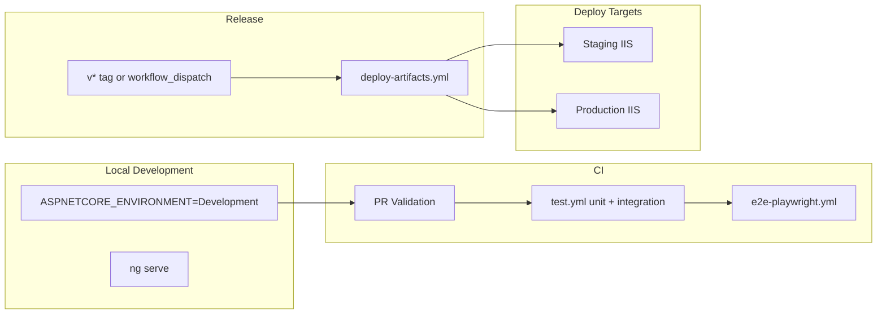

# Deployment Workflow

## Overview



---

## Environments

| Environment | Backend | Frontend build | Deploy trigger |
|-------------|---------|----------------|----------------|
| Development | `dotnet run` | `ng serve` | Local |
| Testing | `ASPNETCORE_ENVIRONMENT=Testing` | `ng build --configuration=testing` | CI tests only |
| Staging | IIS + Staging | `npm run build:staging` | Manual / pipeline extension |
| Production | IIS + Production | `npm run build:production` | Tag `v*.*.*` or approved release |

---

## CI/CD (GitHub Actions)

| Workflow | Trigger | Purpose |
|----------|---------|---------|
| `pr-validation.yml` | PR | Fast gates |
| `test.yml` | PR/push `main`,`develop` | Unit, integration, Karma, coverage |
| `e2e-playwright.yml` | Scheduled/PR | E2E |
| `deploy-artifacts.yml` | Tag `v*`, manual | API + **production** frontend zips |

### Release artifact pipeline

1. Run filtered integration tests (`ProductionConfiguration`, `EnvironmentAppSettings`, CSRF/CORS)
2. `dotnet publish` API Release
3. `ng build --configuration=production`
4. Upload `LogoDesignPortal-API.zip`, `LogoDesignPortal-Frontend.zip`

### Staging pipeline (recommended extension)

Add job or manual step:

```yaml
- name: Build Angular (staging)
  working-directory: Frontend
  run: npm ci && npm run build:staging
```

Deploy staging zip to staging IIS; set `ASPNETCORE_ENVIRONMENT=Staging`.

---

## Staging deployment flow

1. CI green on release candidate
2. Complete `STAGING_DEPLOYMENT_CHECKLIST.md`
3. Deploy API with staging `web.config` + env vars
4. Run EF migrations
5. Deploy frontend `build:staging`
6. Post-deploy: health, auth, SignalR, upload smoke
7. QA sign-off → production window

---

## Production deployment flow

1. Staging validated
2. Complete `DEPLOYMENT_CHECKLIST.md`
3. Deploy API artifact; verify env vars (no placeholders)
4. Deploy frontend production build
5. `POST_DEPLOY_VALIDATION.md`
6. Monitor logs / health for 30–60 minutes

See `RELEASE_PROCESS.md`, `PRODUCTION_DEPLOYMENT_GUIDE.md`.

---

## Migration safety

- **Never** rely on `Database:RunAfterStartup` in Staging/Production
- Run `dotnet ef database update` or approved SQL during maintenance window
- Backup before migrate; test rollback script on staging first

---

## Smoke testing after deploy

| Check | Endpoint / action |
|-------|-------------------|
| Liveness | `GET /health/live` |
| Readiness | `GET /health/ready` |
| Auth | Login + CSRF cookie flow |
| SignalR | Hub connect + notification |
| Upload | Small PNG within limits |
| Redis | Readiness includes Redis (when configured) |

---

## Rollback

See `ROLLBACK_GUIDE.md` — retain previous zip + DB restore point per release.
