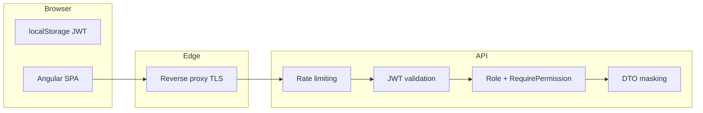

# Security Audit Report — Logo Design Portal

**Audit date:** May 2026  
**Scope:** `Backend/src/`, `Frontend/`  
**Status:** Critical IDOR fixed in this audit cycle; remaining items tracked below.

---

## Executive summary

The platform follows a **backend-authoritative** security model with JWT auth, role-based access, and DTO-level role masking for the mediated client/designer workflow. Several production gaps were identified; **high-severity file download IDOR** and **Swagger exposure** were addressed in code during this audit.

---

## Security architecture



---

## Findings matrix

### Fixed in this audit

| ID | Severity | Finding | Fix |
|----|----------|---------|-----|
| SEC-001 | **Critical** | Client could download hidden preview files by GUID (`DownloadFileAsync` lacked `IsVisibleToClient`) | Enforced in `FileService.DownloadFileAsync`; tests added |
| SEC-002 | **High** | Swagger UI enabled in all environments | Limited to Development/Staging in `Program.cs` |
| SEC-003 | **Medium** | Missing security headers | `SecurityHeadersMiddleware` (HSTS, X-Frame-Options, CSP report-only) |
| SEC-004 | **Medium** | Upload filename/path risks | `UploadSecurityHelper.SanitizeOriginalFileName`, MIME cross-check |
| SEC-005 | **Medium** | Competing 401 logout in Angular | `HttpLoadingErrorInterceptor` defers to `TokenInterceptor` |
| SEC-006 | **High** | JWT in localStorage | httpOnly cookies (`AuthCookieService`), CSRF middleware, FE `useCookieAuth` |
| SEC-007 | **Medium** | Permissions not enforced on file/order APIs | `[RequirePermission]` + default role permission seed on startup |
| SEC-008 | **Medium** | State machine bypass | `OrderStatusTransitionHelper` + expanded transitions |

### Open — high priority

| ID | Severity | Finding | Files | Recommendation |
|----|----------|---------|-------|----------------|
| SEC-010 | **High** | JWT signing key in `appsettings.json` | `appsettings.json`, `appsettings.Production.json` | Use `Jwt__Key` env var / Key Vault only |
| SEC-011 | **High** | Tokens in `localStorage` (XSS → session theft) | `auth.service.ts` | Migrate to httpOnly Secure SameSite cookies + CSRF token for mutations |
| SEC-012 | **High** | Permission system mostly unused | Controllers | Wire `[RequirePermission]` on file/order/financial endpoints |
| SEC-013 | **Medium** | State machine bypass on workflow paths | `OrderService`, `RevisionService` | Centralize transitions via `OrderStatusStateMachine.ValidateTransition` |
| SEC-014 | **Medium** | Magic bytes not validated for `.ai`, embroidery formats | `FileService.ValidateFile` | Add signatures or server-side conversion sandbox |
| SEC-015 | **Medium** | `InputSanitizationMiddleware` disabled | `Program.cs` | Re-enable with safe body handling for JSON APIs |
| SEC-016 | **Medium** | Hangfire dashboard on `/hangfire` | `Program.cs` | IP allowlist or disable in production |
| SEC-017 | **Low** | SignalR token in query string | `Program.cs`, hub | Short-lived hub tokens; avoid logging query strings |
| SEC-018 | **Low** | Identifier leakage in DTOs (`SenderId`, etc.) | Order/Message DTOs | Null GUIDs for cross-role responses |

---

## Control coverage

| Control | Status |
|---------|--------|
| Authentication (JWT) | ✅ Implemented |
| Authorization (roles) | ✅ Primary model |
| Authorization (permissions) | ⚠️ Partial |
| Role masking | ✅ Service layer |
| Rate limiting | ✅ Redis or in-process |
| Upload validation | ✅ Improved |
| Production kill-switch | ✅ `ProductionSafetyOptions` |
| Audit logging | ✅ `AuditLogService` |
| CSRF (cookie auth) | ✅ CsrfValidationMiddleware + X-XSRF-TOKEN when AuthCookies enabled |
| CSP (enforcing) | ⚠️ Report-only |

---

## API security rules (mandatory)

1. Every endpoint must validate **ownership** (order.client, assigned designer) in the service layer.
2. Never return designer/client identifiers across roles in DTOs.
3. All status changes must respect `OrderStatusStateMachine` or use existing workflow methods.
4. File visibility: clients only `IsVisibleToClient` or `Final`.
5. Financial mutations respect `ProductionSafetyOptions` in non-prod.
6. No secrets in source control; fail fast on placeholder connection strings in Production (`Program.cs`).

---

## CSP recommendations (frontend)

When deploying Angular:

```
Content-Security-Policy:
  default-src 'self';
  script-src 'self';
  style-src 'self' 'unsafe-inline';
  img-src 'self' data: https:;
  connect-src 'self' https://api.<your-domain> wss://api.<your-domain>;
  frame-ancestors 'none';
  base-uri 'self';
```

Use report-only mode first (`SecurityHeadersMiddleware` already sets report-only baseline).

---

## Incident recovery

1. Rotate `Jwt__Key` (invalidates all sessions).
2. Toggle `ProductionSafety` flags to stop uploads/billing.
3. Review `AuditLog` + Serilog for `correlationId`.
4. Roll back API deployment; DB migrations are forward-only — use companion down scripts only if tested (`docs/PRODUCTION-MIGRATION-SAFETY.md`).

---

## Test coverage added

- `FileServiceDownloadVisibilityTests` (unit)
- `FilesControllerDownloadSecurityTests` (integration)
- `UploadSecurityHelperTests` (unit)

See `docs/QA_TESTING_STRATEGY.md` for full security test plan.
