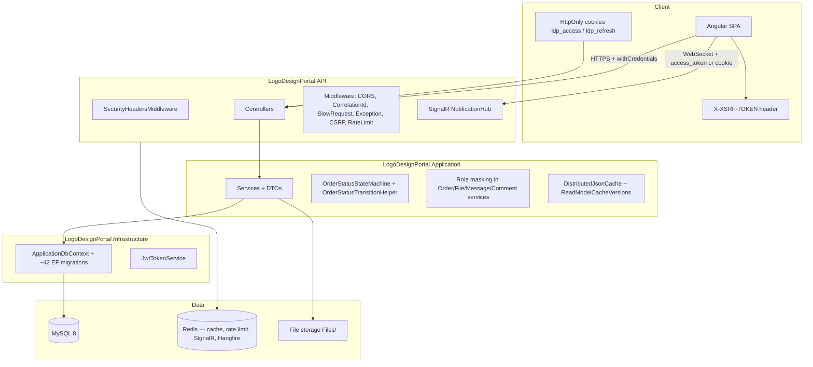

# Logo Design Portal — Architecture Onboarding (Updated)

**Scope:** `Backend/src/` (canonical API) + `Frontend/` (Angular 15)  
**Last updated:** May 2026

**Week 1 hardening:** See `docs/WEEK1_SECURITY_HARDENING.md`, `docs/CI_CD_SETUP.md`, `docs/PRODUCTION_SECURITY_CHECKLIST.md`. Swagger is **Development-only**. Upload policy is centralized in `UploadSecurityHelper`.

---

## 1. System overview



**Business purpose:** B2B logo design operations — clients request work, admins assign designers, designers deliver previews, clients approve or revise, billing/invoicing (USD client / PKR designer payout), analytics, and quotes before formal orders.

---

## 2. Backend layering (`Backend/src/`)

| Layer | Project | Responsibility |
|-------|---------|----------------|
| Domain | `LogoDesignPortal.Domain` | Entities, enums, `OrderStatusStateMachine` |
| Application | `LogoDesignPortal.Application` | Business logic, DTOs, `ProductionSafetyOptions`, services, distributed read-model cache |
| Infrastructure | `LogoDesignPortal.Infrastructure` | EF Core, JWT, email, Redis wiring |
| API | `LogoDesignPortal.API` | HTTP, SignalR, Hangfire, middleware, `AuthCookieService`, `Program.cs` |

**Dependency flow:** API → Application + Infrastructure; Infrastructure → Application → Domain.

**Pattern:** Services use `IApplicationDbContext` directly. `IRepository<T>` is registered but unused (legacy).

**Ignore:** Legacy `Backend/LogoDesignPortal.API/` tree (not in solution).

---

## 3. Order workflow & state machine

- **Definition:** `LogoDesignPortal.Domain/OrderStatusStateMachine.cs`
- **Application helper:** `OrderStatusTransitionHelper` — preferred for workflow methods (assign, preview, cancel, revision, price approval); validates via state machine before applying status.
- **Strict path:** `OrderService.UpdateOrderStatusAsync` and related APIs must not bypass the machine.

**Key statuses:**

| Status | Typical next |
|--------|----------------|
| `WaitingForAdminApproval` | `InProgress`, `PriceApprovalPending`, cancelled variants |
| `PriceApprovalPending` | `InProgress`, `WaitingForAdminApproval`, cancelled |
| `InProgress` | `PreviewDelivered`, `PriceApprovalPending`, cancelled |
| `PreviewDelivered` | `RevisionRequested`, `ClientApproved`, cancelled |
| `RevisionRequested` | `PreviewDelivered`, `InProgress`, `PriceApprovalPending`, cancelled |
| `ClientApproved` | `Completed` |
| `Completed` | `Refunded` |

**Role masking (mediated workflow):**

- Clients never see designer identity (`AssignedDesignerDisplayName = "Company Design Team"`).
- Designers never see client PII in order/file/message DTOs.
- Implemented in `OrderService`, `FileService`, `MessageService`, `CommentService` — not in the frontend.

---

## 4. Quotes (pre-order)

- **API:** `QuotesController` — `api/quotes` (client create; admin review/convert).
- **Domain:** Quote entity + attachments; migration `AddQuotesSystem`.
- **Frontend:** Lazy `quotes` module (`/quotes`, `/quotes/:id`).
- Quotes can convert to `LogoOrder` with `OrderSource` tracking.

---

## 5. Production safety kill-switch

`ProductionSafetyOptions` (`appsettings` section `ProductionSafety`):

| Flag | Effect |
|------|--------|
| `DisableFileUploads` | Blocks uploads |
| `DisableBillingGeneration` | Skips invoice auto-generation |
| `DisableDesignerPayout` | Skips payout generation |
| `DisableInvoiceEditing` | Blocks invoice edits |

Used in staging to protect financial operations during deploys. See `docs/PRODUCTION-SAFETY-KILL-SWITCH.md`.

---

## 6. Authentication & authorization

### Cookie-based auth (recommended production path)

| Piece | Location |
|-------|----------|
| HttpOnly access/refresh cookies | `AuthCookieService`, set on login/register/refresh in `AuthController` |
| CSRF double-submit | `CsrfValidationMiddleware` + non-HttpOnly `ldp_csrf` cookie + `X-XSRF-TOKEN` header |
| JWT from cookie | `JwtBearerEvents.OnMessageReceived` reads cookie when no Bearer header |
| Frontend | `environment.useCookieAuth: true`, `CookieCredentialsInterceptor`, `CsrfInterceptor` |
| CORS | `AllowCredentials()` required for cross-origin cookie auth |

**Config:** `AuthCookies` section in `appsettings.json` (`Enabled`, cookie names, `CsrfHeaderName`, `SameSite`, `Secure`).

**Bearer fallback:** Integration tests and tooling can still send `Authorization: Bearer`; CSRF is skipped when Bearer is present.

### JWT & roles

- **JWT** (HMAC-SHA256): access + refresh; claims include user id, email, role.
- **Primary enforcement:** `[Authorize(Roles = "...")]` on controllers.
- **Granular permissions:** DB-seeded `Permission` + `[RequirePermission]` on select endpoints; SuperAdmin bypasses.
- **SignalR:** Token via `access_token` query on `/hubs/notifications` (WebSockets); hub verifies `JoinUserGroup(userId)` matches authenticated user. Cookie auth also works via `OnMessageReceived`.

**Never** rely on Angular guards alone for security.

---

## 7. API pipeline (startup order)

`Program.cs` — notable middleware order:

1. Swagger — **Development/Staging only** (not production)
2. `ForwardedHeaders` (IIS/reverse proxy)
3. `SecurityHeadersMiddleware` (HSTS, X-Frame-Options, CSP report-only)
4. CORS (before auth — OPTIONS preflight)
5. `CorrelationIdMiddleware`, `SlowRequestPerformanceMiddleware`, Serilog request logging
6. `ExceptionMiddleware`
7. HTTPS redirection (non-Development)
8. Authentication → `CsrfValidationMiddleware` → Authorization
9. Hangfire dashboard `/hangfire` (authorized filter)
10. `RateLimitingMiddleware` (Redis-backed when configured)
11. Controllers, SignalR hub, `/health`, `/health/ready`

**Startup services:** `DatabaseInitializationHostedService` (migrations/seed), `FileStorageInitializer`, Hangfire recurring jobs via `ScalabilityServiceRegistration`.

---

## 8. Scalability & Redis

`ScalabilityServiceRegistration` + `Scalability:AllowInMemoryFallback`:

| When Redis configured | Used for |
|----------------------|----------|
| Yes (required in prod when fallback false) | Distributed cache, cluster rate limiting, SignalR backplane (`ldp:signalr`), Hangfire storage |
| No / fallback true | In-process cache/rate limit/Hangfire — **single instance only** |

**Read-model cache:** `DistributedJsonCache` + `ReadModelCacheVersions` (epoch bumps for users, orders, analytics, roles) invalidate cached list/dashboard payloads after mutations.

**Health:** `/health/ready` includes database schema readiness, Hangfire storage, Redis (when configured).

**DB concurrency:** `LogoOrder.RowVersion`, `Invoice.RowVersion`; indexes for status/analytics (e.g. `StatusUpdatedAt`).

---

## 9. File upload architecture

```
Client/Designer → FilesController → FileService
  → ProductionSafety check
  → Order access + lock + AllowUploads
  → UploadSecurityHelper (extension whitelist, magic bytes, sanitized filename)
  → Per-file / multipart limits (UploadLimits)
  → GUID storage name (path traversal guard)
  → IFileUploadScanHook (Null in dev; plug ClamAV/cloud in prod)
  → IsVisibleToClient rules (designer previews hidden until admin send)
```

**Download security:** `FileService.DownloadFileAsync` enforces `IsVisibleToClient` / `FileType.Final` for clients (IDOR fix — do not bypass in new endpoints).

---

## 10. Billing, invoices & payouts

| Area | Controllers / services |
|------|------------------------|
| Client billing | `BillingController`, `InvoiceService`, `BillingAutoInvoiceService` (Hangfire) |
| Payments | `PaymentsController` (PayPal webhook, Wise, bank) |
| Designer payout | `DesignerPayoutController`, `DesignerInvoiceController` |
| Pricing | `ClientLogoPricingController`, `DesignerLogoPricingController` |
| Admin financial | `Admin/FinancialController`, `Admin/AnalyticsController`, `Admin/AdminClientAnalyticsController` |

Dual pricing fields on orders: client charge (USD) vs designer payout (PKR-centric). Respect `ProductionSafetyOptions` for billing edits and auto-generation.

---

## 11. Frontend architecture

- **Lazy-loaded** feature modules under `MainLayoutComponent` + `AuthGuard` (single layout — avoids sidebar blink).
- **RoleGuard** on admin/financial/quotes routes; `PermissionGuard` exists but is not wired to routes.
- **Auth:** `AuthService` — cookie mode avoids persisting JWT in localStorage; user profile may still use session/local storage for display.
- **Interceptors (order matters in `app.module.ts`):** `CookieCredentialsInterceptor`, `CsrfInterceptor`, `TokenInterceptor`, `HttpLoadingErrorInterceptor` (toasts/timeouts only — no full-screen blocker).
- **Scoped loading UX:** `app-skeleton-dashboard` on dashboard, order list, invoice list, analytics — initial load shows skeleton; refetches keep layout visible.
- **State:** BehaviorSubject services, `SharedListDataService` (shareReplay), SignalR via `RealtimeNotificationService`.
- **Large components:** `order-detail`, `dashboard` — decomposition candidates.

**Paths:** `@core`, `@shared`, `@environments`.

---

## 12. API surface (summary)

**Base:** `{apiUrl}/api` | **JSON:** camelCase | **24 controllers** under `LogoDesignPortal.API/Controllers/`

| Area | Route prefix | Notes |
|------|--------------|-------|
| Auth | `api/auth` | login, register, refresh, logout (clears cookies), password reset |
| Orders | `api/orders` | CRUD, assign, status, batch preview, refund |
| Quotes | `api/quotes` | Client quotes, admin conversion |
| Files | `api/files` | upload, download (authorized + visibility) |
| Invoices | `api/invoices` | generate, mark-paid, PDF |
| Billing | `api/billing` | Queue, client billing |
| Payments | `api/payments` | PayPal webhook (anonymous where applicable) |
| Admin | `api/admin/*` | Financial, analytics, client intelligence |
| Realtime | `hubs/notifications` | SignalR |
| Health | `health`, `health/ready` | DB schema, Hangfire, Redis |

---

## 13. CI/CD & testing

| Workflow | Purpose |
|----------|---------|
| `.github/workflows/test.yml` | Domain, Application, Integration tests; Angular unit; production build; coverage gates |
| `.github/workflows/e2e-playwright.yml` | Playwright E2E (`Frontend/e2e/tests/`) |

| Layer | Location |
|-------|----------|
| Domain unit | `LogoDesignPortal.Domain.Tests` |
| Application unit | `LogoDesignPortal.Application.Tests` |
| API integration | `LogoDesignPortal.API.IntegrationTests` (`[Collection("Integration")]`) |
| E2E | `Frontend/e2e/tests/security/`, `workflows/` |

Module QA guides: `docs/QA_*_MODULE.md`, `docs/TESTING_*_MODULE.md`.

---

## 14. Environment setup (multi-environment)

| Environment | Backend | Frontend build | Upload path |
|-------------|---------|----------------|-------------|
| Development | `appsettings.Development.json` + User Secrets | `ng serve` / `environment.development.ts` | `Files_Dev` |
| Testing | `appsettings.Testing.json` (not published) | `ng build --configuration=testing` | `Files_Test` |
| Staging | `appsettings.Staging.json` + IIS env | `npm run build:staging` | `Files_Staging` |
| Production | `appsettings.Production.json` + IIS env | `npm run build:production` | `Files` |

**Startup validators:** `ProductionSecretsValidator`, `EnvironmentConfigurationValidator` (fail-fast on placeholders).

| Variable / config | Purpose |
|-------------------|---------|
| `ConnectionStrings__DefaultConnection` | MySQL |
| `ConnectionStrings__Redis` | Cache, rate limit, SignalR, Hangfire (required Staging/Production) |
| `Jwt__Key`, `Jwt__Issuer`, `Jwt__Audience` | JWT signing (min 32 chars) |
| `AuthCookies:*` | HttpOnly cookie + CSRF names |
| `FileStorage__Path` | Upload root per environment (not web-served) |
| `Cors:AllowedOrigins` | SPA origins (HTTPS-only in Staging/Production) |
| `ProductionSafety:*` | Kill switches (billing/payout disabled in staging by default) |
| `RateLimiting:*` | Per-minute limits (Redis-backed when scaled) |

**Ops docs:** `ENVIRONMENT_SETUP_GUIDE.md`, `STAGING_SETUP_GUIDE.md`, `SECRET_MANAGEMENT_GUIDE.md`, `DEPLOYMENT_WORKFLOW.md`, `ENVIRONMENT_AUDIT_REPORT.md`.

Development: User Secrets. Production: IIS `web.config` env vars or Key Vault — **never commit real secrets**.

Frontend: `environment.prod.ts` → `apiUrl`, `useCookieAuth: true`.

---

## 15. Key files for new engineers

| Topic | File |
|-------|------|
| Startup | `Backend/src/LogoDesignPortal.API/Program.cs` |
| Scalability | `Backend/src/LogoDesignPortal.API/Hosting/ScalabilityServiceRegistration.cs` |
| Cookie auth | `Backend/src/LogoDesignPortal.API/Services/AuthCookieService.cs` |
| CSRF | `Backend/src/LogoDesignPortal.API/Middleware/CsrfValidationMiddleware.cs` |
| Orders | `Backend/src/LogoDesignPortal.Application/Services/OrderService.cs` |
| State machine | `Backend/src/LogoDesignPortal.Domain/OrderStatusStateMachine.cs` |
| Transitions | `Backend/src/LogoDesignPortal.Application/Helpers/OrderStatusTransitionHelper.cs` |
| Files | `Backend/src/LogoDesignPortal.Application/Services/FileService.cs` |
| Auth | `Backend/src/LogoDesignPortal.Application/Services/AuthService.cs` |
| Frontend routing | `Frontend/src/app/app-routing.module.ts` |
| Frontend auth | `Frontend/src/app/core/services/auth.service.ts` |
| Interceptors | `Frontend/src/app/app.module.ts` |

---

## 16. AI / agent development rules

- Use **`Backend/src/` only** — never legacy backend folders.
- Enforce security on the **API** — not only Angular guards.
- Status changes via **`OrderStatusStateMachine`** / **`OrderStatusTransitionHelper`**.
- Apply **DTO role masking** for any new client/designer fields.
- Register services in `Application/DependencyInjection.cs`.
- Respect **`ProductionSafetyOptions`** for billing, files, payout.
- When cookie auth is enabled, test mutating APIs with **CSRF header** or use Bearer in integration tests.
- Forbidden: exposing `PasswordHash`; serving `Files/` as static content; Material UI on frontend.

---

## 17. Related documents

- `docs/SECURITY_AUDIT_REPORT.md`
- `docs/QA_TESTING_STRATEGY.md`
- `docs/PRODUCTION_READINESS_CHECKLIST.md`
- `docs/PRODUCTION-SAFETY-KILL-SWITCH.md`
- `docs/PERFORMANCE_OPTIMIZATION_REPORT.md`
- `docs/TECHNICAL_DEBT_REPORT.md`
- `.cursor/rules/architecture.mdc`, `.cursor/rules/testing.mdc`
