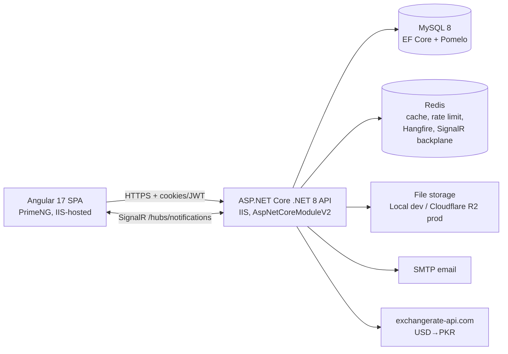

# Architecture

Verified against the codebase as of the latest migration (`20260609233733_AddInvoiceExchangeRateColumns`). Related deep-dives already exist under `docs/architecture/` (SYSTEM_OVERVIEW, BACKEND_ARCHITECTURE, FRONTEND_ARCHITECTURE, etc.); this document is the current consolidated reference.

## System overview



- Frontend: `admin.hawkmerchandising.com` (production), `staging-admin.hawkmerchandising.com` (staging)
- API: `api.hawkmerchandising.com` / `staging-api.hawkmerchandising.com`
- Hosting: Windows IIS, in-process (`Backend/src/LogoDesignPortal.API/web.config`)

## Clean Architecture layers (backend)

Strict dependency direction — never violated:

```
Domain  ←  Application  ←  Infrastructure
   ↖            ↖              ↖
    └────────────┴──────────────┴──  API
```

| Layer | Project | Contains | Depends on |
|---|---|---|---|
| Domain | `Backend/src/LogoDesignPortal.Domain` | 30 entities (`BaseEntity` with soft delete), ~24 enums, `OrderStatusStateMachine` | nothing |
| Application | `Backend/src/LogoDesignPortal.Application` | 29 services, DTOs, interfaces (`IOrderService`, `IFileStorageService`, …), helpers (`OrderStatusTransitionHelper`, `UploadSecurityHelper`, `ClientCurrencyHelper`, …), AutoMapper profiles, QuestPDF invoice rendering | Domain |
| Infrastructure | `Backend/src/LogoDesignPortal.Infrastructure` | `ApplicationDbContext` + 48 migrations, JWT token service + key rotation, Redis, currency service, Local/R2 storage, email | Application, Domain |
| API | `Backend/src/LogoDesignPortal.API` | 27 controllers, 9 middleware classes, `NotificationHub`, Hangfire setup, health checks, `Program.cs` | all |

Folders `Backend/LogoDesignPortal.*` outside `src/` are legacy and unused.

## Technologies and versions (verified from .csproj / package.json)

| Component | Version |
|---|---|
| .NET / ASP.NET Core | net8.0 |
| EF Core / Pomelo MySQL | 8.0.0 (MySQL server version 8.0.21 configured) |
| Serilog.AspNetCore | 10.0.0 |
| Hangfire.AspNetCore / Redis storage | 1.8.17 / 1.9.3 |
| StackExchange.Redis | 2.8.24 |
| SignalR Redis backplane | 8.0.11 |
| AutoMapper | 12.0.1 |
| QuestPDF | 2024.12.2 |
| BCrypt.Net-Next | 4.0.3 |
| AWSSDK.S3 (Cloudflare R2) | 3.7.412.2 |
| OpenTelemetry | 1.15.x (disabled by default) |
| Swashbuckle (Swagger, dev-only) | 6.5.0 |
| Angular / PrimeNG | ^17.0.0 / ^17.0.0 |
| TypeScript / RxJS | ~5.2.0 / ~7.8.1 |
| @microsoft/signalr | ^10.0.0 |
| Playwright | ^1.58.2 |
| xUnit / Moq | 2.6.2 / 4.20.70 |

## API request pipeline (Program.cs order)

1. Swagger (Development only)
2. Forwarded headers (X-Forwarded-For/Proto — IIS/reverse proxy)
3. `CorsPreflightMiddleware` (answers OPTIONS before IIS interferes) → `UseCors`
4. `SecurityHeadersMiddleware` (X-Content-Type-Options, X-Frame-Options, HSTS outside dev, CSP-Report-Only)
5. `CorrelationIdMiddleware` (X-Correlation-Id → Serilog context)
6. `SlowRequestPerformanceMiddleware` (warns ≥500 ms)
7. Serilog request logging
8. `ExceptionMiddleware` (global handler → JSON `{message, correlationId}`, no stack traces to clients)
9. HTTPS redirection (non-Development)
10. Authentication (JWT bearer; token also read from `ldp_access` cookie and `access_token` query param on `/hubs/*`)
11. `CsrfValidationMiddleware` (double-submit `ldp_csrf` cookie vs `X-XSRF-TOKEN` header; only for cookie-authed mutating requests; auth/health/hubs exempt)
12. Authorization
13. `HangfireDashboardAccessMiddleware` + Hangfire dashboard at `/hangfire` (`HangfireAuthorizationFilter`: Admin/SuperAdmin; `HangfireReadOnlyFilter`: Admin read-only)
14. `RateLimitingMiddleware` (Redis-backed distributed; auth 5/min, order mutations 120/min, uploads 30/min, general 60/min; disabled in Development/Testing)
15. Endpoints: controllers, `NotificationHub` (`/hubs/notifications`), health checks (`/health`, `/health/ready`, `/health/live`)

`InputSanitizationMiddleware` exists but is intentionally disabled in the pipeline.

## Authentication and authorization

- **JWT**: HMAC-SHA256, claims = user id/email/name/role/jti. `JwtSigningKeyRotationHelper` validates against `Jwt:Key` plus optional `Jwt:PreviousKey` (rotation window); issuance always uses the current key. `Jwt:Key` must be ≥32 chars, supplied via env/User Secrets.
- **Cookies** (browser default): HttpOnly `ldp_access` + `ldp_refresh`, non-HttpOnly `ldp_csrf`. Set by `AuthCookieService` on login/register/refresh; cleared on logout. `Secure=true`, `SameSite=None` (relaxed in Testing).
- **Refresh tokens**: 64 random bytes, stored on the `User` row, 168 h default lifetime, rotated on refresh. Refresh endpoint accepts body or cookies.
- **Lockout**: 5 failed logins → 30-minute lockout.
- **Roles** (seeded, fixed GUIDs): SuperAdmin, Admin, Designer, Client. Custom RBAC — not ASP.NET Identity.
- **Permissions**: 16 seeded permissions (CreateOrder, AssignOrder, UploadFile, DownloadFile, DeleteFile, ViewAllOrders, UpdateOrderStatus, user/role/designer-profile management, …) linked via `RolePermissions`. `[RequirePermission("Name")]` filter checks per-request; **SuperAdmin bypasses permission checks**. Managed via `PermissionsController` (SuperAdmin only).
- **Role masking**: enforced in Application DTO mapping — clients see designers as "Design Team"; designers never receive client PII or client price threads.

## Background jobs and real-time

- **Hangfire**: Redis storage (prefix `hangfire:ldp:`) in staging/prod; MemoryStorage in dev/testing. Jobs: email sending, `OrphanFileCleanupService` (temporary-file sweep), `BillingAutoInvoiceService` (weekly/monthly auto-invoicing). Server not started in Testing.
- **SignalR**: `NotificationHub` at `/hubs/notifications`, `[Authorize]`, users join their own group only. Redis backplane (`ldp:signalr`) outside dev/testing. Two channels: bell notifications (`IRealtimeNotificationSender`) and entity grid-sync events (`IRealtimeEntityUpdateSender` — OrderCreated, OrderStatusChanged, PreviewDelivered, InvoiceGenerated, …). Frontend falls back to 60-second polling when disconnected.

## Data and storage

- **Database**: single `ApplicationDbContext`; MySQL via Pomelo when the connection string is a server address, SQLite when it contains `Data Source=`/`.db` (tests, lightweight dev). Retry-on-failure, 120 s command timeout, slow-query logging interceptor. Soft-delete global query filters on 12 entities. `RowVersion` concurrency tokens on `LogoOrders` and `Invoices`. See [database.md](database.md).
- **Migrations**: 48, in `LogoDesignPortal.Infrastructure/Migrations`. Development applies them on startup (`DatabaseInitializationHostedService`); **Staging/Production set `Database:RunAfterStartup=false` — migrations are applied manually at release time** (see [deployment.md](deployment.md)).
- **File storage**: `IFileStorageService` abstraction; `Storage:Provider` selects `LocalFileStorageService` (dev/testing: `Files_Dev`/`Files_Test`) or `R2FileStorageService` (staging/prod: Cloudflare R2 bucket `hawk-files` via S3 API). Path traversal guarded by `StorageKeyHelper`. All downloads go through authorized API endpoints. `MigrateLocalFilesToR2` is a manual one-time utility.
- **Currency**: `CurrencyService` fetches USD→PKR from exchangerate-api.com, caches in Redis + memory, degrades to last-known then hardcoded fallback (280). Invoice issuance snapshots the rate onto the invoice. `ClientCurrencyHelper` normalizes ISO codes (USD, GBP, EUR, PKR, CAD, AUD, INR, JPY).

## Core business workflows (summary)

Full detail in [module-map.md](module-map.md) and [api.md](api.md).

- **Orders**: Client creates (`WaitingForAdminApproval`) → admin approves/assigns (`InProgress` or `ApprovedUnassigned`) → optional client price approval (`PriceApprovalPending`) → designer uploads previews (hidden) → admin releases previews (`PreviewDelivered`) → client requests revisions (limit by price tier: 2/4/unlimited) or approves (`ClientApproved`) → admin completes (`Completed`, sets `BillingEligible`) → optional `Refunded`. All transitions validated by `OrderStatusStateMachine`; terminal statuses lock files/comments/revisions.
- **Quotes**: Client submits (`Pending`, attachments ≤10 / 500 MB combined) → admin responds with price (`Responded`) → client rejects or converts to an order (`Converted`, order inherits quote currency, `OrderSource=Quote`).
- **Invoices/payments**: Invoices built from completed billing-eligible orders (manual, billing queue, or automatic weekly/monthly Hangfire job; PerLogo clients auto-invoice on completion). PKR invoices get an exchange-rate snapshot. Paid invoices can't be edited. Payments via PayPal/Wise links, webhook at `POST /api/payments/webhook/paypal`. Designer payouts are a parallel PKR invoice system (`DesignerInvoice`) with admin-approved designer pricing.
- **Files**: Upload requires order access (client owns / designer assigned / admin) + `AllowUploads` + non-terminal status + `UploadSecurityHelper` validation + 1-hour duplicate window. Designer uploads stay invisible to clients until admin releases them. Orphaned temporary files swept by Hangfire.

## Observability and health

- Serilog structured JSON to console (compact), correlation IDs, request logging, slow-request warnings.
- OpenTelemetry (traces/metrics via OTLP or Azure Monitor) available but **off by default** (`Observability:Enabled=false`).
- Health endpoints: `/health` (full), `/health/ready` (DB schema, Hangfire, storage, disk, SMTP, memory, SignalR; Redis failure = Degraded), `/health/live` (process), and anonymous `GET /api/system/health` (database/signalr/storage summary) used by monitors and troubleshooting.

## Environment differences

| Concern | Development | Testing | Staging | Production |
|---|---|---|---|---|
| Swagger | On | Off | Off | Off |
| Migrations | Auto on startup | `EnsureCreated` | Manual | Manual |
| Redis | Optional (in-memory fallback) | Skipped | Required | Required |
| Storage | Local `Files_Dev` | Local `Files_Test` | R2 | R2 |
| Rate limiting | Disabled | Disabled | On | On |
| JWT access token | 60 min | test key | 60 min | **30 min** |
| Payments | — | — | Test mode | Live |
| ProductionSafety kill-switches | Off | Off | Billing + designer payout disabled | None configured |

## Known gaps / TODO

- `InputSanitizationMiddleware` disabled by design; input safety relies on validation + parameterized EF queries. TODO: confirm this remains intentional.
- `IFileUploadScanHook` defaults to `NullFileUploadScanHook` — no virus scanning wired in production. TODO.
- Invoice email sending (`SendInvoiceAsync`) is logged but not implemented (TODO in code).
- Entity/schema drift: `ReferenceWebsite` column exists in the DB snapshot but not on the `LogoOrder` entity class. TODO: reconcile.
- Frontend `PermissionGuard` exists but is not used in routing (RoleGuard only).
