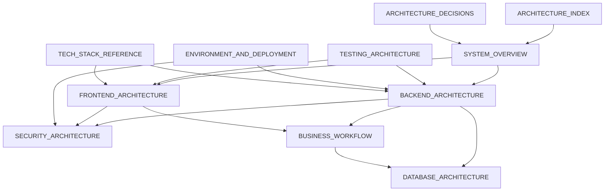

# Architecture Documentation Index

**Logo Design Portal / Hawk Merchandising Web Portal**  
**Canonical code:** `Backend/src/` · `Frontend/`  
**Generated:** May 2026 — implementation-verified architecture package

---

## Start here

| Audience | Document |
|----------|----------|
| New engineer (quick) | [../UPDATED_ARCHITECTURE_ONBOARDING.md](../UPDATED_ARCHITECTURE_ONBOARDING.md) |
| New engineer (deep) | [SYSTEM_OVERVIEW.md](./SYSTEM_OVERVIEW.md) |
| Security reviewer | [SECURITY_ARCHITECTURE.md](./SECURITY_ARCHITECTURE.md) |
| DevOps / release | [ENVIRONMENT_AND_DEPLOYMENT_ARCHITECTURE.md](./ENVIRONMENT_AND_DEPLOYMENT_ARCHITECTURE.md) · [../../ops/DEPLOYMENT_CHECKLIST.md](../../ops/DEPLOYMENT_CHECKLIST.md) |
| QA / test lead | [TESTING_ARCHITECTURE.md](./TESTING_ARCHITECTURE.md) |

---

## Core architecture documents

| # | Document | Description |
|---|----------|-------------|
| 1 | [SYSTEM_OVERVIEW.md](./SYSTEM_OVERVIEW.md) | Platform purpose, modules, roles, request lifecycle, principles |
| 2 | [FRONTEND_ARCHITECTURE.md](./FRONTEND_ARCHITECTURE.md) | Angular modules, routing, guards, interceptors, SignalR, PrimeNG |
| 3 | [BACKEND_ARCHITECTURE.md](./BACKEND_ARCHITECTURE.md) | .NET layers, services, pipeline, state machine, Redis, Hangfire |
| 4 | [DATABASE_ARCHITECTURE.md](./DATABASE_ARCHITECTURE.md) | EF Core schema, ER diagrams, migrations, indexing, permissions |
| 5 | [SECURITY_ARCHITECTURE.md](./SECURITY_ARCHITECTURE.md) | Auth, CSRF, JWT, uploads, IDOR, hardening checklist |
| 6 | [TESTING_ARCHITECTURE.md](./TESTING_ARCHITECTURE.md) | Unit, integration, Playwright, CI workflows, coverage |
| 7 | [ENVIRONMENT_AND_DEPLOYMENT_ARCHITECTURE.md](./ENVIRONMENT_AND_DEPLOYMENT_ARCHITECTURE.md) | Environments, IIS, Redis, secrets, release/rollback |
| 8 | [BUSINESS_WORKFLOW_ARCHITECTURE.md](./BUSINESS_WORKFLOW_ARCHITECTURE.md) | Orders, quotes, revisions, billing, notifications, actors |
| 9 | [ARCHITECTURE_DECISIONS_AND_TECH_DEBT.md](./ARCHITECTURE_DECISIONS_AND_TECH_DEBT.md) | Strengths, debt, risks, roadmap |
| 10 | [COMPLETE_TECH_STACK_REFERENCE.md](./COMPLETE_TECH_STACK_REFERENCE.md) | Full package inventory and roles |

---

## Cross-reference map

---

## Topic → document routing

| I need to understand… | Read |
|----------------------|------|
| Cookie + CSRF login | [SECURITY_ARCHITECTURE.md](./SECURITY_ARCHITECTURE.md) · [FRONTEND_ARCHITECTURE.md](./FRONTEND_ARCHITECTURE.md#authentication-flow) |
| Order status transitions | [BACKEND_ARCHITECTURE.md](./BACKEND_ARCHITECTURE.md#51-orderstatusstatemachine) · [BUSINESS_WORKFLOW_ARCHITECTURE.md](./BUSINESS_WORKFLOW_ARCHITECTURE.md#1-order-lifecycle-core) |
| File upload safety | [SECURITY_ARCHITECTURE.md](./SECURITY_ARCHITECTURE.md#6-upload-security-pipeline) |
| Role masking / privacy | [SECURITY_ARCHITECTURE.md](./SECURITY_ARCHITECTURE.md#5-dto-masking) · [BACKEND_ARCHITECTURE.md](./BACKEND_ARCHITECTURE.md#43-dto-masking-strategy) |
| Staging kill switches | [ENVIRONMENT_AND_DEPLOYMENT_ARCHITECTURE.md](./ENVIRONMENT_AND_DEPLOYMENT_ARCHITECTURE.md#15-staging-isolation) · `docs/PRODUCTION-SAFETY-KILL-SWITCH.md` |
| Integration test setup | [TESTING_ARCHITECTURE.md](./TESTING_ARCHITECTURE.md#3-api-integration-testing) |
| CI pipelines | [TESTING_ARCHITECTURE.md](./TESTING_ARCHITECTURE.md#5-ci-testing-flow) |
| Redis / multi-instance | [BACKEND_ARCHITECTURE.md](./BACKEND_ARCHITECTURE.md#10-redis-usage) · `docs/SIGNALR_SCALING_GUIDE.md` |
| IIS deploy + smoke tests | [ENVIRONMENT_AND_DEPLOYMENT_ARCHITECTURE.md](./ENVIRONMENT_AND_DEPLOYMENT_ARCHITECTURE.md#16-operational-runbooks-ops) · [../../ops/DEPLOYMENT_CHECKLIST.md](../../ops/DEPLOYMENT_CHECKLIST.md) |
| MySQL backup / restore | `ops/BACKUP_RUNBOOK.md` · `ops/backup-mysql.ps1` |
| Entity relationships | [DATABASE_ARCHITECTURE.md](./DATABASE_ARCHITECTURE.md#5-er-diagrams) |
| NuGet / npm packages | [COMPLETE_TECH_STACK_REFERENCE.md](./COMPLETE_TECH_STACK_REFERENCE.md) |

---

## Complementary operational docs (`docs/`)

| Area | Existing guides |
|------|-----------------|
| Deployment | `DEPLOYMENT_WORKFLOW.md`, `PRODUCTION_DEPLOYMENT_GUIDE.md`, `STAGING_SETUP_GUIDE.md` |
| Security ops | `PRODUCTION_SECURITY_CHECKLIST.md`, `FILE_UPLOAD_SECURITY.md`, `WEEK1_SECURITY_HARDENING.md` |
| Testing modules | `TESTING_*_MODULE.md`, `QA_*_MODULE.md`, `PLAYWRIGHT_TESTING_GUIDE.md` |
| Performance | `PERFORMANCE_OPTIMIZATION_REPORT.md`, `DB_PERFORMANCE_REPORT.md` |
| Incidents | `INCIDENT_RESPONSE_GUIDE.md`, `ROLLBACK_GUIDE.md` |

---

## Operational runbooks (`ops/`)

Scripts and checklists at the repository root **`ops/`** folder (used for manual IIS releases on Windows Server).

| File | Purpose |
|------|---------|
| [../../ops/DEPLOYMENT_CHECKLIST.md](../../ops/DEPLOYMENT_CHECKLIST.md) | Pre/post deploy checklist, junction layout, artifact naming |
| [../../ops/deploy.ps1](../../ops/deploy.ps1) | API release deploy (junction swap) |
| [../../ops/deploy-frontend.ps1](../../ops/deploy-frontend.ps1) | Angular static deploy |
| [../../ops/smoke-test.ps1](../../ops/smoke-test.ps1) | Post-deploy HTTP smoke checks |
| [../../ops/BACKUP_RUNBOOK.md](../../ops/BACKUP_RUNBOOK.md) | MySQL backup strategy and schedule |
| [../../ops/backup-mysql.ps1](../../ops/backup-mysql.ps1) | Automated MySQL dump |
| [../../ops/restore-mysql.ps1](../../ops/restore-mysql.ps1) | Restore from backup |
| [../../ops/redis-restart.md](../../ops/redis-restart.md) | Redis service restart procedure |
| `ops/artifacts/` | Staging area for CI ZIPs before deploy |

Architecture context: [ENVIRONMENT_AND_DEPLOYMENT_ARCHITECTURE.md](./ENVIRONMENT_AND_DEPLOYMENT_ARCHITECTURE.md). Env vars: [../ENVIRONMENT_VARIABLE_REFERENCE.md](../ENVIRONMENT_VARIABLE_REFERENCE.md).

---

## Agent / contributor rules

- `.cursor/rules/architecture.mdc` — layering, state machine, masking
- `.cursor/rules/testing.mdc` — required test layers per change

---

## Maintenance

When making architectural changes, update the relevant doc in `docs/architecture/` in the same PR. The onboarding summary at `docs/UPDATED_ARCHITECTURE_ONBOARDING.md` should remain a short entry point linking here.
