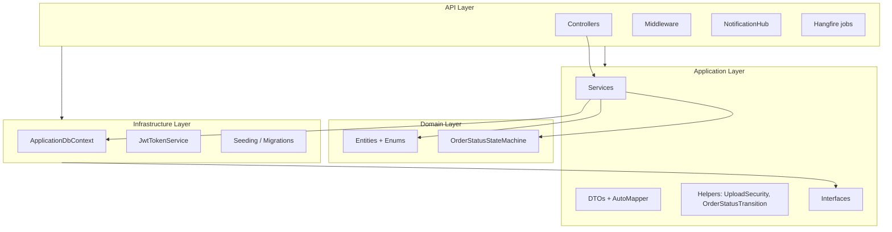
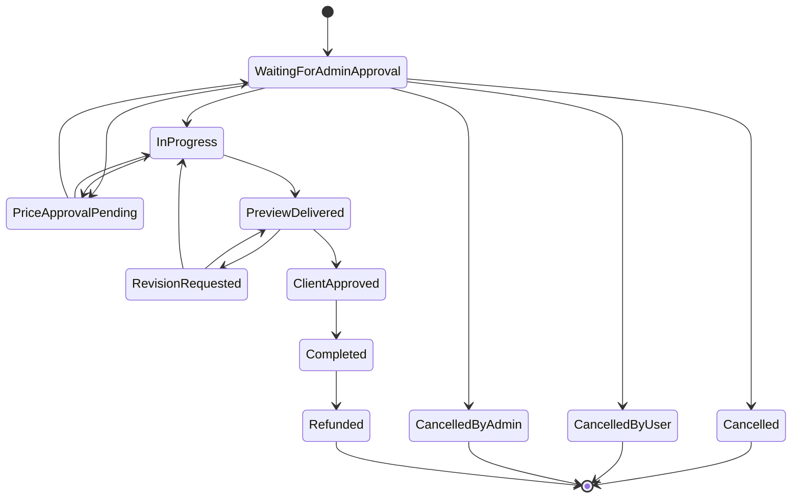
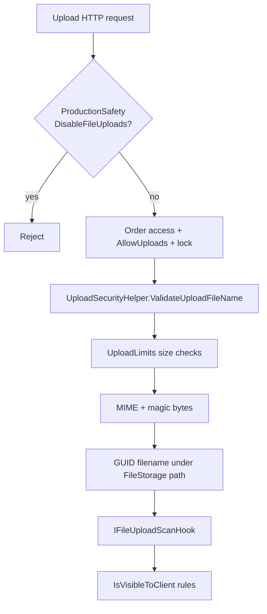
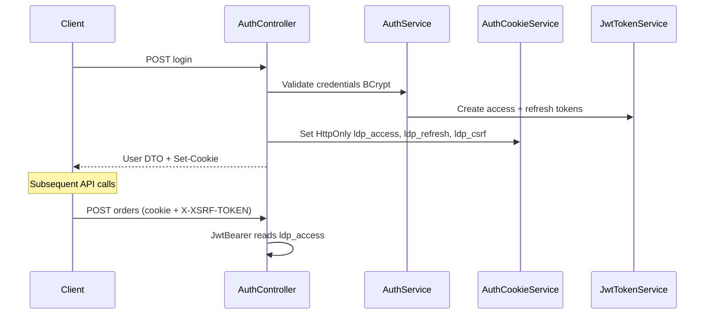

# Backend Architecture — .NET 8 Clean Architecture

**Canonical root:** `Backend/src/` only  
**Related:** [DATABASE_ARCHITECTURE.md](./DATABASE_ARCHITECTURE.md) · [SECURITY_ARCHITECTURE.md](./SECURITY_ARCHITECTURE.md) · [BUSINESS_WORKFLOW_ARCHITECTURE.md](./BUSINESS_WORKFLOW_ARCHITECTURE.md)

---

## 1. Solution projects

| Project | References | Responsibility |
|---------|------------|----------------|
| `LogoDesignPortal.Domain` | — | Entities, enums, `OrderStatusStateMachine` |
| `LogoDesignPortal.Application` | Domain | Business logic, DTOs, helpers, interfaces |
| `LogoDesignPortal.Infrastructure` | Application, Domain | EF Core, JWT, migrations, seeding |
| `LogoDesignPortal.API` | Application, Infrastructure | HTTP, SignalR, Hangfire, middleware |
| `*.Tests` / `*.IntegrationTests` | Respective targets | Automated verification |

**Dependency rule:** Domain has no outward dependencies. Application depends only on Domain. Infrastructure implements Application persistence/auth abstractions. API composes the host.

---

## 2. Layered architecture



---

## 3. API layer

### 3.1 Controllers (27 files)

Default route: `[Route("api/[controller]")]` unless overridden.

| Controller | Route | Class auth | Notable patterns |
|------------|-------|------------|------------------|
| `AuthController` | `api/auth` | Mixed | Anonymous login/register/refresh; `[Authorize]` profile |
| `OrdersController` | `api/orders` | `[Authorize]` | `[RequirePermission]` on create/assign/status |
| `FilesController` | `api/files` | `[Authorize]` | Upload/download/delete permissions |
| `InvoicesController` | `api/invoices` | `[Authorize]` | Tenant checks in service |
| `PaymentsController` | `api/payments` | `[Authorize]` | `[AllowAnonymous]` webhook |
| `QuotesController` | `api/quotes` | `[Authorize]` | Client vs admin actions |
| `RevisionsController` | `api/revisions` | `[Authorize]` | Workflow by role |
| `PermissionsController` | `api/permissions` | `SuperAdmin` | Permission CRUD |
| `SystemController` | `api/system` | `[AllowAnonymous]` | Ops health (distinct from `/health`) |
| `Admin/*` | `api/admin/...` | `SuperAdmin,Admin` | Analytics, financial |

Full inventory: see exploration table in [SYSTEM_OVERVIEW.md](./SYSTEM_OVERVIEW.md).

### 3.2 Request processing pipeline


**Startup validators** (before `app.Build()`): `ProductionSecretsValidator`, `EnvironmentConfigurationValidator`.

**Post-build:** `FileStorageInitializer`, `ScalabilityServiceRegistration.AddRecurringJobsIfEnabled`.

---

## 4. Application layer

### 4.1 Pattern: service-oriented (not CQRS)

- No MediatR/commands/queries.
- Each bounded context has an `I*Service` + `*Service` class.
- Registration: `LogoDesignPortal.Application/DependencyInjection.cs` (27 scoped services).

### 4.2 Application services

| Service | Primary responsibility |
|---------|------------------------|
| `AuthService` | Login, refresh, BCrypt passwords, reset tokens |
| `UserService` | Users, designer profiles, directory |
| `RoleService` | Roles + cached permissions |
| `PermissionService` | `UserHasPermissionAsync` for attribute filter |
| `OrderService` | CRUD, assign, status, masking, concurrency (`RowVersion`) |
| `FileService` | Upload/download, visibility, storage paths |
| `RevisionService` | Revision rounds + files |
| `CommentService` | Order comments + visibility |
| `MessageService` | Order messaging, admin relay |
| `InvoiceService` / `InvoicePdfService` | Client invoicing, QuestPDF |
| `BillingService` | Billing queue |
| `PaymentService` | Payments, mark-paid, webhooks |
| `DesignerPayoutService` | Designer invoices, adjustments |
| `NotificationService` | In-app + enqueue email jobs |
| `QuoteService` | Pre-order quotes |
| `AnalyticsService` + financial/client variants | Cached read models |
| `ClientLogoPricingService` / `DesignerLogoPricingService` | Pricing tables |
| `GalleryService`, `ReviewService`, `SettingsService`, `AuditLogService` | Supporting domains |

### 4.3 DTO masking strategy

Masking is applied in **services** when building response DTOs (not in AutoMapper global rules alone).

**Example (`OrderService`):**
- Client role: `AssignedDesignerDisplayName = "Company Design Team"`; designer user id nulled.
- Designer/Admin: client company/contact fields masked per rules.
- Never expose `PasswordHash`, internal audit-only fields.

**Why server-side:** Prevents IDOR/data leaks via direct API calls, Postman, or compromised SPA.

### 4.4 Validation architecture

| Layer | Mechanism |
|-------|-----------|
| Input | Data annotations on DTOs; service guard clauses |
| Business | `OrderStatusStateMachine`, `ProductionSafetyOptions` |
| Upload | `UploadSecurityHelper` + `UploadLimits` |
| Authorization | Controller attributes + service `EnsureAccess` patterns |

### 4.5 Caching strategy

| Component | Purpose |
|-----------|---------|
| `DistributedJsonCache` | JSON-serialized read models in Redis |
| `ReadModelCacheVersions` | Epoch keys (users, orders, analytics) — bump on mutation to invalidate |
| `RoleService` | Permission lookups cached per user |

When Redis unavailable and `AllowInMemoryFallback: true` (dev only), cache is process-local — **not safe multi-instance**.

---

## 5. Domain layer

### 5.1 `OrderStatusStateMachine`

**File:** `LogoDesignPortal.Domain/OrderStatusStateMachine.cs`



**Application helper:** `OrderStatusTransitionHelper` — preferred entry for workflow methods; `ApplyAdminCancellation` bypasses graph for admin cancel from non-terminal states.

### 5.2 Repository pattern status

`IRepository<T>` + `Repository<T>` are registered in Infrastructure but **unused** by services. Services inject `IApplicationDbContext` directly.

**Rationale (inferred):** Simpler queries for complex includes; repository abstraction left for potential future extraction.

---

## 6. Infrastructure layer

### 6.1 EF Core

- **Context:** `ApplicationDbContext` — 30 `DbSet`s, fluent configurations in `Persistence/Configurations/`.
- **Provider:** MySQL 8 via Pomelo; SQLite for integration tests / local test connection strings containing `.db`.
- **Soft delete:** Global query filters on `IsDeleted` for User, LogoOrder, LogoFile, Invoice, profiles, etc.
- **Auditing:** `BaseEntity.CreatedAt` / `UpdatedAt` on `SaveChangesAsync`.
- **Transactions:** `ExecuteInTransactionAsync` with execution strategy for retries.

### 6.2 Migrations

- **~45 migrations** in `Infrastructure/Migrations/`
- **Deploy:** `Database:RunAfterStartup` true in dev; **false** staging/production (pipeline/`--repair-database` CLI)
- **Seeding:** `DatabaseStartupSeeder` — roles, permissions, role-permission links

### 6.3 JWT

`JwtTokenService` (Infrastructure): HMAC-SHA256 access + refresh tokens; claims: NameIdentifier, Email, Name, Role.

API `JwtBearer` reads Bearer header **first**, then `ldp_access` cookie (`OnMessageReceived`).

---

## 7. Authorization architecture

```mermaid
flowchart TD
  REQ[HTTP Request] --> AUTHN{Authenticated?}
  AUTHN -->|no| A401[401 Challenge]
  AUTHN -->|yes| ROLE{[Authorize Roles]?}
  ROLE -->|fail| A403[403 Forbid]
  ROLE -->|ok| PERM{[RequirePermission]?}
  PERM -->|no| SVC[Service layer tenant check]
  PERM -->|yes| SA{SuperAdmin?}
  SA -->|yes| SVC
  SA -->|no| DB{Permission in DB?}
  DB -->|no| A403
  DB -->|yes| SVC
```

**`RequirePermissionAttribute`:** `LogoDesignPortal.API/Attributes/RequirePermissionAttribute.cs` — async filter; fail closed if `IPermissionService` missing.

---

## 8. Upload validation pipeline



**`UploadSecurityHelper`:** blocked extensions, path traversal, double-extension decoys, MIME map, magic-byte verification.

**`FileService`:** additional business file types (vectors, embroidery formats) beyond helper MIME table.

**Download:** `DownloadFileAsync` enforces client visibility and `FileType.Final` rules (IDOR protection).

---

## 9. SignalR backend

| Item | Detail |
|------|--------|
| Hub | `NotificationHub` at `/hubs/notifications` |
| Auth | `[Authorize]`; token from query `access_token` or cookie |
| Groups | `user-{userId}` after `JoinUserGroup` validates identifier |
| Senders | `SignalRRealtimeNotificationSender`, `SignalRRealtimeEntityUpdateSender` |
| Scale-out | `AddStackExchangeRedis` backplane prefix `ldp:signalr` (skipped in Testing env) |

---

## 10. Redis usage

Via `ScalabilityServiceRegistration`:

| Feature | When Redis configured |
|---------|----------------------|
| `IDistributedCache` | Read-model JSON cache |
| Rate limiting | `IDistributedRateLimiter` cluster-wide |
| SignalR | Backplane |
| Hangfire | `Hangfire.Redis` job storage |

**Production/Staging:** `AllowInMemoryFallback: false` → Redis **required** or startup fails.

---

## 11. Background jobs

| Job | Schedule | Implementation |
|-----|----------|----------------|
| `orphan-preview-files` | Daily | `OrphanFileCleanupService` |
| `billing-auto-invoice` | Daily | `BillingAutoInvoiceService` |
| Email | On demand | `EmailHangfireJobs` via `HangfireBackgroundJobScheduler` |

**Testing:** `NullBackgroundJobScheduler` — no Hangfire side effects.

**Dashboard:** `/hangfire` — `HangfireDashboardAuthorizationFilter` (admin roles).

---

## 12. Logging & observability

| Component | Role |
|-----------|------|
| Serilog | Compact JSON console; config from `appsettings` |
| CorrelationIdMiddleware | Propagates `X-Correlation-ID` |
| SlowRequestPerformanceMiddleware | Warns on slow requests |
| OpenTelemetry | Optional via `AddPortalObservability` |
| Health checks | `database_schema`, `hangfire`, `file_storage`, `redis`, `smtp`, `disk_space`, `memory`, `signalr` |

---

## 13. Error handling

`ExceptionMiddleware` maps exceptions to JSON error responses; suppresses stack details when `IncludeExceptionDetailsInProduction` is false.

---

## 14. File storage strategy

| Setting | Purpose |
|---------|---------|
| `FileStorage:Path` | Root directory **outside** web-served static files |
| Subpaths | `Temporary/`, `Permanent/` created by `FileStorageInitializer` |
| Stored name | GUID + sanitized extension — prevents path traversal |
| Environments | `Files`, `Files_Dev`, `Files_Staging`, `Files_Test` |

---

## 15. appsettings hierarchy

| File | Environment | Key overrides |
|------|-------------|---------------|
| `appsettings.json` | All | Base Serilog, Cors, Jwt placeholders, RateLimiting, AuthCookies |
| `appsettings.Development.json` | Development | In-memory fallback allowed, `Files_Dev`, extra CORS ports |
| `appsettings.Staging.json` | Staging | ProductionSafety kill switches, staging hosts, `Files_Staging` |
| `appsettings.Production.json` | Production | Shorter JWT access token, production CORS, payments |
| `appsettings.Testing.json` | Testing | SQLite, test JWT, lax cookies — **not published** |

Environment variables use `__` nesting (e.g. `ConnectionStrings__Redis`).

---

## 16. Auth / token flow



---

## 17. Scalability considerations

| Area | Approach |
|------|----------|
| API instances | Stateless JWT/cookies; Redis required for shared state |
| DB | Indexes on status, notifications, files; `RowVersion` on orders/invoices |
| Files | Local disk per server — plan shared storage or CDN for multi-node |
| Hangfire | Redis storage prevents duplicate recurring execution per app instance |
| Read models | Distributed cache reduces dashboard load |

---

## 18. Key files index

| Topic | Path |
|-------|------|
| Startup | `LogoDesignPortal.API/Program.cs` |
| DI (app) | `LogoDesignPortal.Application/DependencyInjection.cs` |
| DI (infra) | `LogoDesignPortal.Infrastructure/DependencyInjection.cs` |
| State machine | `LogoDesignPortal.Domain/OrderStatusStateMachine.cs` |
| Orders | `LogoDesignPortal.Application/Services/OrderService.cs` |
| Files | `LogoDesignPortal.Application/Services/FileService.cs` |
| Upload security | `LogoDesignPortal.Application/Helpers/UploadSecurityHelper.cs` |
| Scalability | `LogoDesignPortal.API/Hosting/ScalabilityServiceRegistration.cs` |
| CSRF | `LogoDesignPortal.API/Middleware/CsrfValidationMiddleware.cs` |
| Cookies | `LogoDesignPortal.API/Services/AuthCookieService.cs` |
