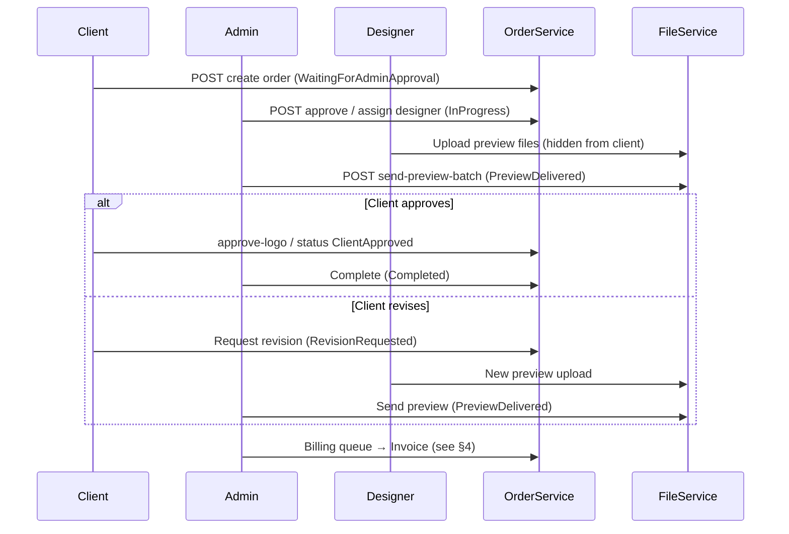
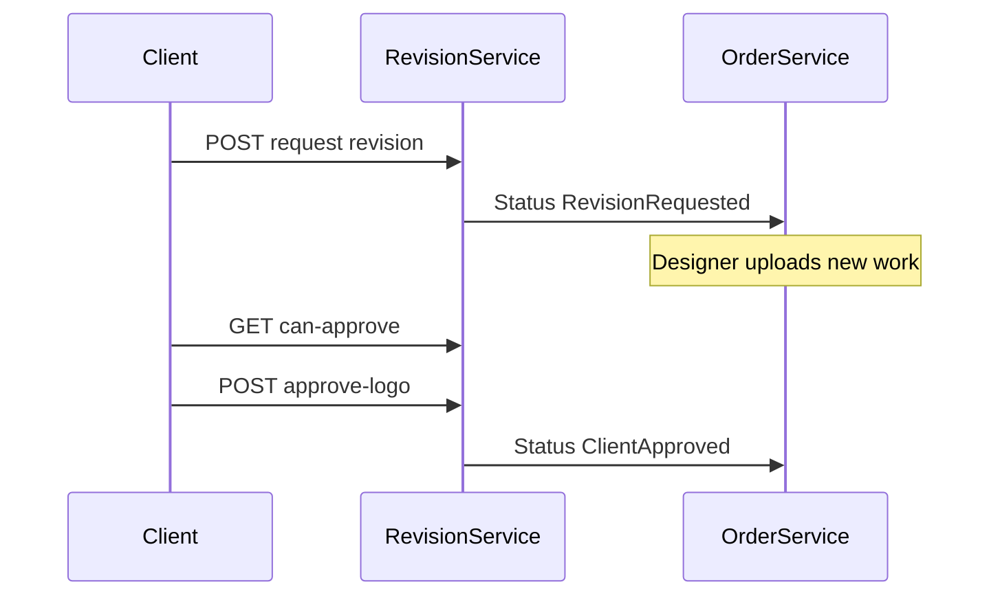
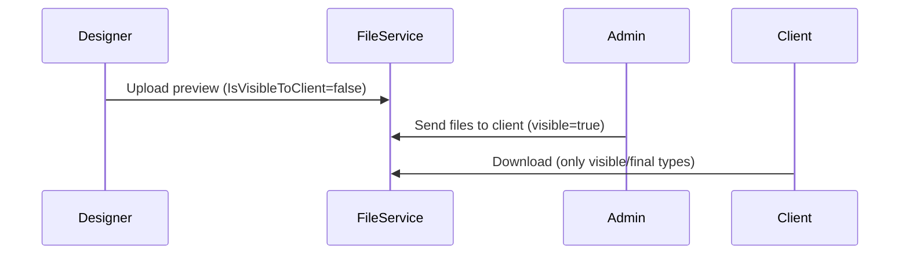
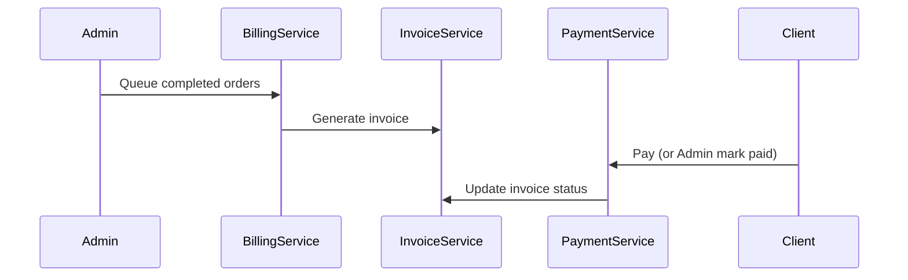
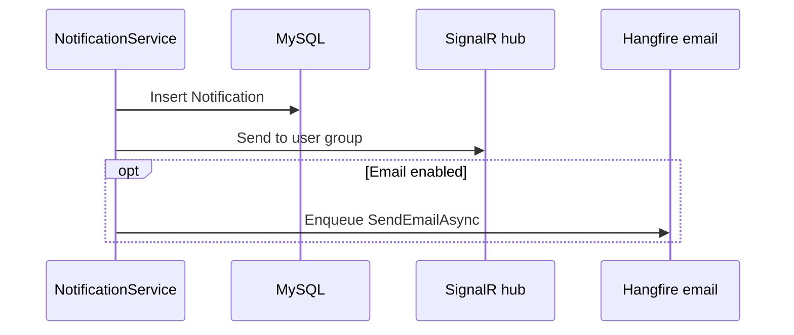
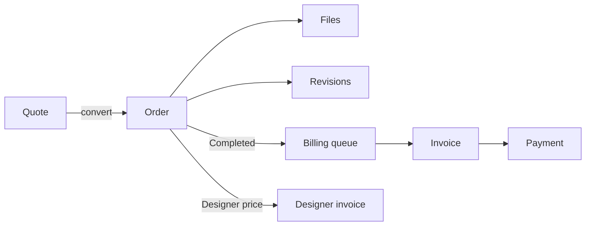

# Business Workflow Architecture

**Related:** [BACKEND_ARCHITECTURE.md](./BACKEND_ARCHITECTURE.md) · [DATABASE_ARCHITECTURE.md](./DATABASE_ARCHITECTURE.md) · [SECURITY_ARCHITECTURE.md](./SECURITY_ARCHITECTURE.md)

All workflows are enforced in **Application services** + **OrderStatusStateMachine**. Frontend enables actions based on API-returned state; it does not define transitions.

---

## 1. Order lifecycle (core)

### 1.1 Actors and permissions

| Actor | Permissions / roles | Typical actions |
|-------|---------------------|-----------------|
| Client | `CreateOrder`, own orders | Create, approve preview, request revision, cancel early |
| Designer | Assigned orders | Upload previews/finals, propose price |
| Admin | `ViewAllOrders`, `AssignOrder`, `UpdateOrderStatus` | Approve, assign, send files to client, price approval |
| SuperAdmin | Bypass permission checks | All admin actions |

### 1.2 Status transitions (authoritative)

See state diagram in [BACKEND_ARCHITECTURE.md](./BACKEND_ARCHITECTURE.md). Terminal states: `Cancelled`, `CancelledByUser`, `CancelledByAdmin`, `Refunded`.

### 1.3 API endpoints (`OrdersController` — `api/orders`)

| Action | Method | Endpoint | Service method area |
|--------|--------|----------|---------------------|
| Create | POST | `/` | `OrderService.CreateOrderAsync` |
| Create with files | POST | `/with-files` | Order + `FileService` |
| List mine | GET | `/my` | Client scoped |
| List assigned | GET | `/assigned` | Designer scoped |
| List all | GET | `/` | Admin + `ViewAllOrders` |
| Get by id | GET | `/{id}` | Masked DTO |
| Assign | POST | `/{id}/assign` | `AssignOrder` permission |
| Update status | PUT | `/{id}/status` | State machine |
| Approve order (admin) | POST | `/{id}/approve` | → `InProgress` |
| Price approval | POST | `/{id}/request-price-approval`, `/approve-price`, `/respond-price-approval` | PKR designer pricing |
| Send files to client | POST | `/{id}/send-files-to-client` | Visibility flip |
| Send preview batch | POST | `/{id}/send-preview-batch` | → `PreviewDelivered` |
| Cancel | POST | `/{id}/cancel` | Client vs admin rules |
| Archive / unarchive | POST | `/{id}/archive`, `/unarchive` | Admin |
| Refund | POST | `/{id}/refund` | → `Refunded` |
| Update charge price | PUT | `/{id}/client-charge-price` | Admin |
| Allow uploads flag | PUT | `/{id}/allow-uploads` | Admin lock |

### 1.4 Frontend modules

| Step | Module / component |
|------|------------------|
| List | `orders/order-list` |
| Create | `orders/order-create` |
| Detail / actions | `orders/order-detail`, `order-progress-timeline` |
| Upload | `orders/file-upload` or embedded in detail |

### 1.5 Complete order lifecycle (sequence)

---

## 2. Quote lifecycle (pre-order)

| Step | Actor | API | Service |
|------|-------|-----|---------|
| Submit quote | Client | `POST api/quotes` | `QuoteService` |
| List / view | Client / Admin | `GET api/quotes`, `/{id}` | Scoped by role |
| Admin respond | Admin | `POST api/quotes/{id}/respond` | |
| Reject | Admin | `POST api/quotes/{id}/reject` | |
| Convert to order | Admin | `POST api/quotes/{id}/convert-to-order` | Creates `LogoOrder` |

**Frontend:** `quotes` module — `/quotes`, `/quotes/:id`.

**Validation:** Attachments pass `UploadSecurityHelper` in quote file flows.

---

## 3. Revision workflow

| Step | Actor | API | Transition |
|------|-------|-----|------------|
| Check can request | Client | `GET api/revisions/orders/{id}/can-request` | Business rules in `RevisionService` |
| Request revision | Client | `POST api/revisions/orders/{id}/request` | → `RevisionRequested` |
| Designer continues | Designer | Upload via `api/files` | → `InProgress` / new preview |
| Send preview | Admin | `send-preview-batch` | → `PreviewDelivered` |
| Approve logo | Client | `POST api/revisions/orders/{id}/approve-logo` | → `ClientApproved` |
| Download revision file | Authorized | `GET api/revisions/files/{fileId}/download` | Access + visibility |

**Frontend:** Order detail revision panel; status timeline.

---

## 4. Upload workflow

| Step | Actor | API | Rules |
|------|-------|-----|-------|
| Upload order file | Client/Designer/Admin | `POST api/files` | `UploadFile` permission; order access |
| Admin send to client | Admin | `POST api/orders/{id}/send-files-to-client` | Sets `IsVisibleToClient` |
| Download | Any authorized | `GET api/files/{id}/download` | Client blocked from hidden previews |
| Delete | Admin | `DELETE api/files/{id}` | `DeleteFile` permission |

**Pipeline:** [SECURITY_ARCHITECTURE.md](./SECURITY_ARCHITECTURE.md#upload-security-pipeline).

**Production safety:** `ProductionSafety.DisableFileUploads` blocks all uploads.

---

## 5. Invoice and payment workflow

### 5.1 Client invoicing

| Step | Actor | API | Service |
|------|-------|-----|---------|
| Generate invoice | Admin | `POST api/invoices` | `InvoiceService` |
| List / PDF | Client/Admin | `GET api/invoices`, PDF endpoints | Tenant scoped |
| Mark paid | Admin/Client | Payment endpoints | `PaymentService` |
| Auto invoice | System | Hangfire `billing-auto-invoice` | `BillingAutoInvoiceService` |

**Kill switch:** `ProductionSafety.DisableBillingGeneration`, `DisableInvoiceEditing`.

### 5.2 Payments

| Step | Actor | API | Notes |
|------|-------|-----|-------|
| Initiate payment | Client | `api/payments` | Provider-specific |
| Webhook | Provider | `POST` webhook action `[AllowAnonymous]` | Signature validation in service |
| Mark paid (manual) | Admin | Admin payment endpoints | Concurrency via `RowVersion` |

**Frontend:** `invoices` module, `payments` module (embedded in dashboard).

### 5.3 Sequence — invoice to paid

---

## 6. Designer assignment workflow

| Step | Actor | API | Validation |
|------|-------|-----|------------|
| Assign designer | Admin | `POST api/orders/{id}/assign` | `AssignOrder` permission; designer profile exists |
| Reassign | Admin | Same endpoint | Order not terminal |
| Designer view | Designer | `GET api/orders/assigned` | Masked client DTO |

**Notification:** SignalR `OrderAssigned` + in-app notification + optional email (Hangfire).

**Frontend:** Admin order detail assign dropdown; designer dashboard assigned list.

---

## 7. Designer payout workflow

| Step | Actor | API | Service |
|------|-------|-----|---------|
| Propose price | Designer | Order price approval endpoints | PKR fields on order |
| Approve price | Admin | `ApprovePrice`, `RespondPriceApproval` | `PriceApprovalPending` ↔ `InProgress` |
| Generate designer invoice | Admin | `api/designer-payout`, `api/designer-invoice` | `DesignerPayoutService` |
| Adjustments | Admin | Adjustment DTOs | `DesignerInvoiceAdjustment` |

**Kill switch:** `ProductionSafety.DisableDesignerPayout`.

**Frontend:** `/financial/designer-payout`.

**Pricing tables:** `ClientLogoPricing`, `DesignerLogoPricing` controllers.

---

## 8. Notification workflow

| Trigger | Producer | Delivery |
|---------|----------|----------|
| Order assigned | `NotificationService` | DB row + SignalR `ReceiveNotification` |
| Preview ready | Order/file events | SignalR order grid events |
| Invoice ready | Billing | Email via Hangfire |
| Password reset | `AuthService` | Email job |

**API:** `api/notifications` — list, mark read.  
**Frontend:** Header bell, `/notifications`; fallback 60s poll if SignalR down.

---

## 9. Messaging workflow

| Step | Actor | API | Rules |
|------|-------|-----|-------|
| Post message | Client/Designer/Admin | `api/messages` | Order-scoped |
| Admin relay | Admin | Relay endpoints | Mediated communication |
| Read thread | Participants | GET by order | Masked sender/recipient fields |

**Frontend:** `/messages`, order detail thread.

---

## 10. Approval and rejection flows

| Flow | Approve path | Reject / cancel path |
|------|--------------|----------------------|
| New order (admin) | `POST approve` → `InProgress` | Cancel endpoints → cancelled statuses |
| Designer price | `ApprovePrice` / `RespondPriceApproval` | Return to `WaitingForAdminApproval` or cancel |
| Client preview | `approve-logo` → `ClientApproved` | `Request revision` or cancel |
| Quote | `respond` | `reject` |

---

## 11. Admin workflows

| Workflow | Primary UI | API |
|----------|------------|-----|
| User management | `/users` | `api/users` |
| Permissions | `/permissions` | `api/permissions` (SuperAdmin) |
| Client intelligence | `/client-intelligence` | `api/admin/client-analytics` |
| Financial dashboard | `/financial` | `api/admin/financial` |
| Analytics | `/analytics` | `api/admin/analytics` |
| Settings / SMTP | `/settings` | `api/settings` |
| Audit logs | SuperAdmin tools | `api/auditlogs` |

---

## 12. Client workflows

| Workflow | Route | Notes |
|----------|-------|-------|
| Create order | `/orders/create` | Pricing from client logo pricing |
| Track orders | `/orders` | Masked designer |
| Pay invoices | `/invoices` | Own tenant only |
| Gallery | `/gallery` | Client role only |
| Quotes | `/quotes` | Pre-order requests |
| Reviews | `/reviews` | Post-completion |

---

## 13. Designer workflows

| Workflow | Route | Notes |
|----------|-------|-------|
| Assigned orders | `/orders` (assigned filter) | No client PII |
| Upload deliverables | Order detail / upload | Previews hidden until admin sends |
| Payout view | `/financial` (designer role) | Designer invoice status |
| Price proposal | Order detail | When complexity requires approval |

---

## 14. Cross-workflow dependencies

---

## 15. Validation rules (cross-cutting)

| Rule | Enforced in |
|------|-------------|
| Illegal status jump | `OrderStatusStateMachine` |
| Cross-tenant access | Service `Ensure*` methods |
| Locked order uploads | `AllowUploads`, order status |
| Financial kill switches | `ProductionSafetyOptions` |
| File visibility | `FileService` on download |
| Duplicate mark-paid | `PaymentService` + regression tests |
