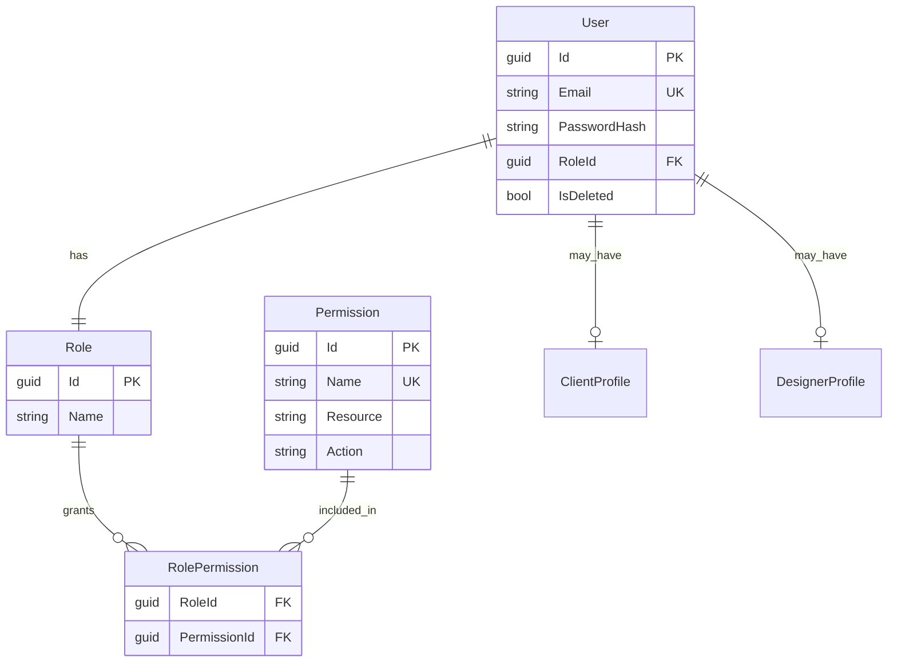
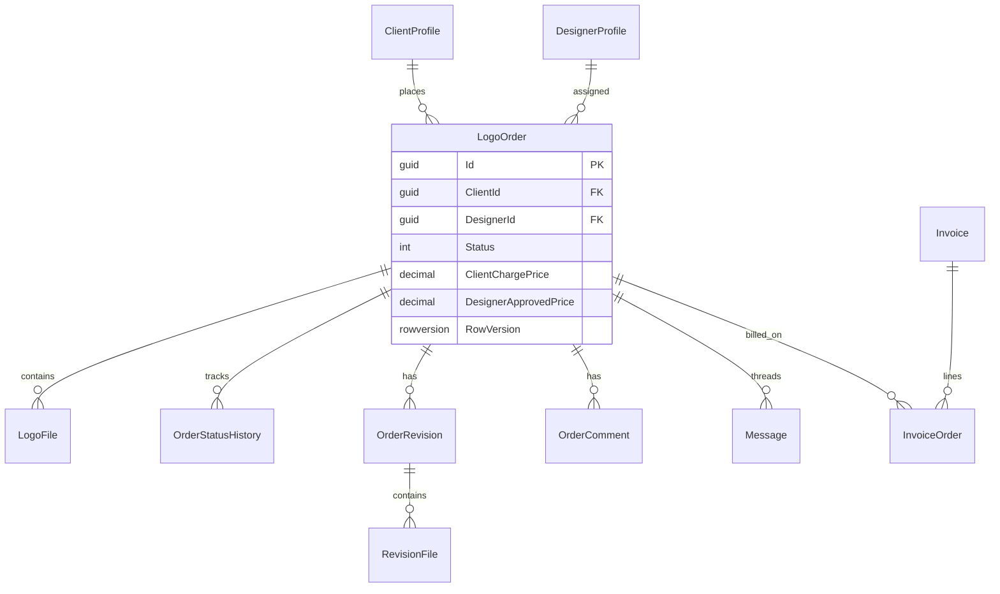
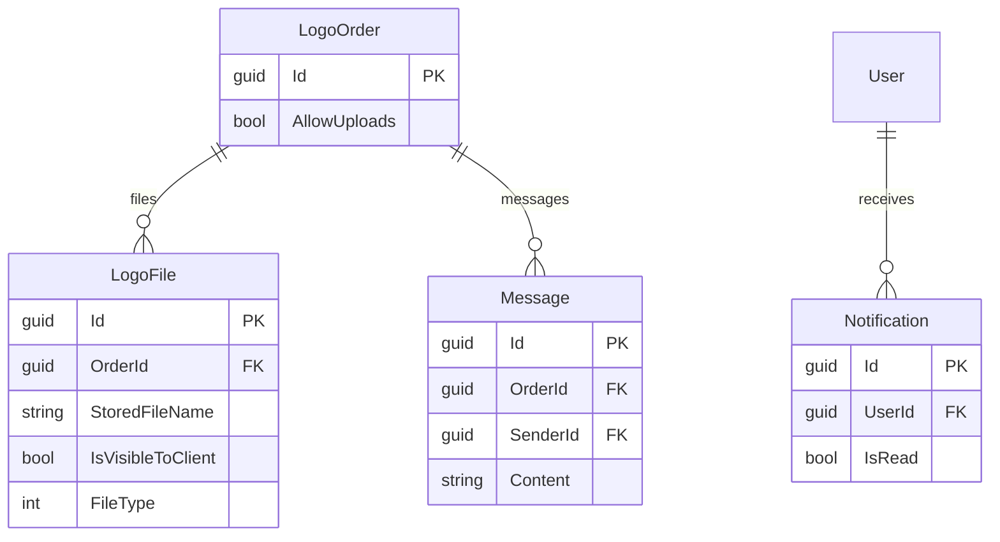
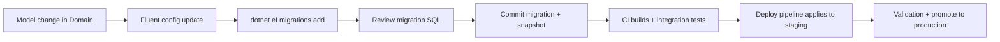

# Database Architecture — EF Core + MySQL 8

**Related:** [BACKEND_ARCHITECTURE.md](./BACKEND_ARCHITECTURE.md) · [SECURITY_ARCHITECTURE.md](./SECURITY_ARCHITECTURE.md) · [BUSINESS_WORKFLOW_ARCHITECTURE.md](./BUSINESS_WORKFLOW_ARCHITECTURE.md)

---

## 1. Design philosophy

| Principle | Implementation |
|-----------|----------------|
| **Relational model** | Normalized entities with explicit FK relationships |
| **EF Core as ORM** | Fluent configurations per entity; no heavy stored procedures |
| **Soft delete** | `IsDeleted` on core aggregates; global query filters |
| **Audit timestamps** | `BaseEntity.CreatedAt` / `UpdatedAt` auto-set on save |
| **History tables** | `OrderStatusHistory`, `OrderLog`, `InvoiceLog` for workflow/financial audit |
| **Optimistic concurrency** | `RowVersion` on `LogoOrder`, `Invoice` (and related hot paths) |
| **Environment isolation** | Separate MySQL databases per environment; never share prod data to dev |

---

## 2. Technology stack

| Component | Package / version |
|-----------|-------------------|
| ORM | EF Core 8.0 |
| Production provider | Pomelo.EntityFrameworkCore.MySql 8.0 (MySQL 8.0) |
| Test provider | Microsoft.EntityFrameworkCore.Sqlite / InMemory |
| Migrations | `Microsoft.EntityFrameworkCore.Tools` |
| Context | `ApplicationDbContext` implements `IApplicationDbContext` |

**Connection resolution** (`Infrastructure/DependencyInjection.cs`):
- If connection string contains `Data Source=` or `.db` → SQLite
- Else → MySQL with retry-on-failure enabled

---

## 3. Schema organization

### 3.1 Entity groups

| Group | Entities |
|-------|----------|
| **Identity** | `User`, `Role`, `Permission`, `RolePermission` |
| **Profiles** | `ClientProfile`, `DesignerProfile` |
| **Orders** | `LogoOrder`, `OrderStatusHistory`, `OrderLog`, `OrderRevision`, `RevisionFile`, `OrderComment` |
| **Files** | `LogoFile` |
| **Quotes** | `Quote` |
| **Messaging** | `Message`, `Notification` |
| **Billing** | `Invoice`, `InvoiceOrder`, `InvoiceLog`, `Payment` |
| **Designer payout** | `DesignerInvoice`, `DesignerInvoiceItem`, `DesignerInvoiceAdjustment` |
| **Pricing** | `DesignPricing`, `ClientLogoPricing`, `DesignerLogoPricing` |
| **Other** | `Review`, `ClientGallery`, `Settings`, `AuditLog` |

### 3.2 Base entity pattern

```csharp
// LogoDesignPortal.Domain/Entities/BaseEntity.cs (conceptual)
public abstract class BaseEntity
{
    public Guid Id { get; set; }
    public DateTime CreatedAt { get; set; }
    public DateTime? UpdatedAt { get; set; }
    public bool IsDeleted { get; set; }
}
```

**Soft-delete filtered entities** (global query filter in `ApplicationDbContext`):
`User`, `LogoOrder`, `LogoFile`, `Invoice`, `ClientProfile`, `DesignerProfile`, `OrderComment`, `Settings`, `ClientGallery`, `AuditLog`, `DesignerLogoPricing`, `Quote`.

---

## 4. Major entity descriptions

| Entity | Purpose | Critical fields |
|--------|---------|-----------------|
| `User` | Login identity | `Email`, `PasswordHash`, `RoleId`, lockout fields, `RefreshToken` |
| `Role` | RBAC role name | Linked to `RolePermissions` |
| `Permission` | Granular action | `Name`, `Resource`, `Action` |
| `ClientProfile` | Client tenant | `UserId`, company/billing fields |
| `DesignerProfile` | Designer workforce | `UserId`, skills, availability |
| `LogoOrder` | Core workflow aggregate | `Status`, pricing fields (USD client / PKR designer), `DesignerId`, `AllowUploads`, `RowVersion` |
| `LogoFile` | Order attachment | `OrderId`, `FileType`, `IsVisibleToClient`, storage path |
| `OrderRevision` | Revision round | Links to `RevisionFile` |
| `Invoice` | Client bill | `ClientId`, status, `RowVersion`, line items via `InvoiceOrder` |
| `DesignerInvoice` | Designer payout batch | PKR amounts, approval workflow |
| `Payment` | Client payment record | Provider refs, webhook correlation |
| `Quote` | Pre-order request | Conversion to `LogoOrder` |
| `Notification` | In-app alert | `UserId`, `IsRead`, payload JSON |
| `Message` | Order thread message | Sender role, visibility |
| `AuditLog` | Security/ops audit | Actor, action, entity refs |

---

## 5. ER diagrams

### 5.1 Users, roles, permissions



### 5.2 Orders and workflow



### 5.3 Uploads and messages



---

## 6. Relationships (summary)

| Parent | Child | Cardinality | Notes |
|--------|-------|-------------|-------|
| `User` | `ClientProfile` / `DesignerProfile` | 0..1 | Role-dependent |
| `ClientProfile` | `LogoOrder` | 1..* | Tenant boundary for client data |
| `DesignerProfile` | `LogoOrder` | 0..* | Assignment nullable until assigned |
| `LogoOrder` | `LogoFile` | 0..* | Cascade rules in `LogoFileConfiguration` |
| `LogoOrder` | `OrderRevision` | 0..* | Revision workflow |
| `Invoice` | `InvoiceOrder` | 1..* | Many orders per invoice possible |
| `ClientProfile` | `Invoice` | 1..* | Client billing scope |

Fluent configs: `Backend/src/LogoDesignPortal.Infrastructure/Persistence/Configurations/*.cs` (30 files).

---

## 7. Indexing strategy

| Location | Index | Purpose |
|----------|-------|---------|
| `ApplicationDbContext.OnModelCreating` | `LogoFile.OrderId` | File lookups per order |
| | `Notification (UserId, IsRead)` | Unread notification queries |
| | `User.Email` | Login lookup |
| `LogoOrderConfiguration` | Status/analytics composites | Dashboard filters (see migrations e.g. `AddClientAnalyticsIndex`, `AddWeek3QueryPerformanceIndexes`) |
| Migrations | Various `IX_*` | Added incrementally for production query plans |

**Concurrency tokens:** `LogoOrder.RowVersion`, `Invoice.RowVersion` — EF throws `DbUpdateConcurrencyException` on conflict; API tests cover concurrent status updates.

---

## 8. Migration strategy

| Aspect | Practice |
|--------|----------|
| Location | `Infrastructure/Migrations/` (~45 migrations + snapshot) |
| Creation | `dotnet ef migrations add` from Infrastructure project |
| Dev apply | `DatabaseInitializationHostedService` when `Database:RunAfterStartup: true` |
| Staging/Prod | `RunAfterStartup: false` — apply in release pipeline before swap |
| Repair CLI | `dotnet run -- --repair-database` — migrate + re-seed roles/permissions |
| Safety | `docs/PRODUCTION-MIGRATION-SAFETY.md` |

**Never** edit applied migration history in production without ops runbook.

---

## 9. Concurrency handling

| Mechanism | Use case |
|-----------|----------|
| `RowVersion` | Order status updates, invoice mark-paid |
| Transactions | `ExecuteInTransactionAsync` for multi-entity financial ops |
| State machine | Prevents illegal status jumps before save |
| Execution strategy | MySQL retry on transient failures |

---

## 10. Audit and history patterns

| Table | Written when |
|-------|--------------|
| `OrderStatusHistory` | Status transitions |
| `OrderLog` | Significant order events |
| `InvoiceLog` | Invoice state changes |
| `AuditLog` | Admin/security-sensitive actions via `AuditLogService` |

---

## 11. Role and permission model

**16 seeded permissions** (`PermissionSeedData.cs`):

`CreateUser`, `ViewUsers`, `UpdateUser`, `DeleteUser`, `ManageRoles`, `CreateDesignerProfile`, `ViewDesignerProfiles`, `UpdateDesignerProfile`, `CreateOrder`, `ViewAllOrders`, `AssignOrder`, `UpdateOrderStatus`, `ManagePermissions`, `UploadFile`, `DownloadFile`, `DeleteFile`.

**Runtime seeding:** `DatabaseStartupSeeder.EnsureRolesPermissionsAndLinksAsync` links permissions to Client/Designer/Admin roles (SuperAdmin implicit full access in code).

**Why DB-backed permissions:** Allows future admin UI changes without redeploying role constants; `[RequirePermission]` checks DB at runtime.

---

## 12. Seeding architecture

| Seeder | When | Content |
|--------|------|---------|
| `DatabaseStartupSeeder` | Startup / repair | Roles, permissions, links |
| `PermissionSeedData` | Migration baseline | Fixed GUID permission rows |
| `TestDataSeeder` | Integration tests only | `client@test.com`, `admin@test.com`, etc. |

**Production:** No test users seeded; real users created via admin registration flows.

---

## 13. Environment DB separation

| Environment | Typical database | Notes |
|-------------|------------------|-------|
| Development | Local `LogoDesignPortalDb` | User Secrets connection string |
| Testing (CI unit) | InMemory per factory | Isolated per `TestWebApplicationFactory` |
| Testing (CI E2E) | MySQL service `LogoDesignPortalDb` | `e2e-playwright.yml` |
| Staging | Dedicated MySQL instance | Credentials via IIS env |
| Production | Dedicated MySQL instance | Backups per `docs/BACKUP_STRATEGY.md` |

---

## 14. Performance considerations

| Topic | Guidance |
|-------|----------|
| N+1 queries | Services use `.Include()` judiciously; analytics use projections/cache |
| Soft deletes | Remember global filters — use `IgnoreQueryFilters()` only in admin/audit code |
| Large files | Metadata in DB; blobs on disk under `FileStorage:Path` |
| Pagination | List endpoints return paged DTOs; frontend `extractPagedMeta` |
| Read replicas | Not implemented — future scaling option |

---

## 15. Security constraints (data layer)

| Constraint | Enforcement |
|------------|-------------|
| Tenant isolation | `ClientId` on orders/invoices — checked in services |
| PII minimization | Masked at DTO layer, not DB |
| Password storage | BCrypt hash only — never returned in queries |
| File paths | DB stores logical names; GUID on disk |

---

## 16. Migration workflow (developer)



---

## 17. Critical indexes (reference)

Consult latest migrations for authoritative definitions. Notable additions:

- `20260308034759_AddClientAnalyticsIndexToLogoOrder`
- `20260521172138_AddWeek3QueryPerformanceIndexes`
- `20260206124650_AddPermissionSystem`

Use `EXPLAIN` on slow dashboards before adding indexes — see `docs/DB_PERFORMANCE_REPORT.md`.
