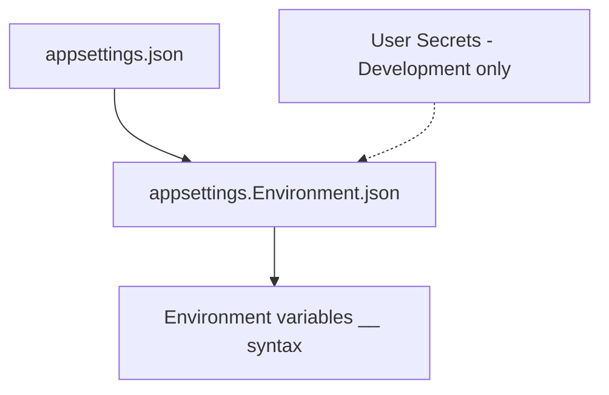
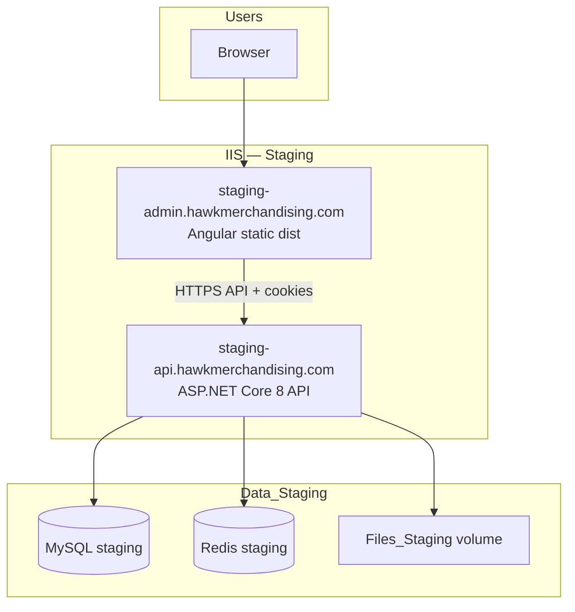
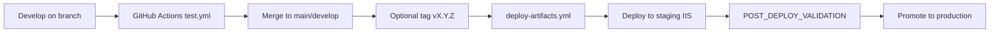

# Environment and Deployment Architecture

**Related:** [SYSTEM_OVERVIEW.md](./SYSTEM_OVERVIEW.md) · [SECURITY_ARCHITECTURE.md](./SECURITY_ARCHITECTURE.md) · `docs/DEPLOYMENT_WORKFLOW.md`, `docs/STAGING_SETUP_GUIDE.md`

---

## 1. Environment matrix

| Environment | `ASPNETCORE_ENVIRONMENT` | Angular configuration | API URL (frontend) | DB | File storage |
|-------------|--------------------------|----------------------|-------------------|-----|--------------|
| **Local** | Development | default / development | `https://localhost:44398` | Local MySQL | `Files_Dev` |
| **Testing (CI)** | Testing | testing / e2e | localhost API | InMemory / SQLite / CI MySQL | `Files_Test` |
| **Staging** | Staging | staging | `https://staging-api.hawkmerchandising.com` | Staging MySQL | `Files_Staging` |
| **Production** | Production | production | `https://api.hawkmerchandising.com` | Production MySQL | `Files` |

---

## 2. Configuration hierarchy



**Precedence:** Environment variables override JSON files.

**Startup validation:**
- `ProductionSecretsValidator` — JWT key placeholders blocked in non-Development
- `EnvironmentConfigurationValidator` — CORS, Redis, connection string sanity

---

## 3. appsettings by environment

| File | Notable settings |
|------|------------------|
| `appsettings.json` | Serilog, Cors localhost, empty Jwt/Storage/ExchangeRate secrets, AuthCookies, RateLimiting |
| `appsettings.Development.json` | `AllowInMemoryFallback: true`, `Files_Dev`, Jwt via User Secrets |
| `appsettings.Staging.json` | Staging hosts, `ProductionSafety` billing/payout disabled, `Storage:Provider: R2`, `Files_Staging`, `Payments.UseTestMode` |
| `appsettings.Production.json` | Production CORS, shorter access token, `Database.RunAfterStartup: false`, `Storage:Provider: R2` |
| `appsettings.Testing.json` | SQLite path, test JWT, **not published** |

---

## 4. Environment variables (operations)

| Variable | Purpose |
|----------|---------|
| `ConnectionStrings__DefaultConnection` | MySQL connection |
| `ConnectionStrings__Redis` | Cache, SignalR, Hangfire, rate limit |
| `Jwt__Key`, `Jwt__Issuer`, `Jwt__Audience` | Signing |
| `AuthCookies__*` | Cookie names, Secure, SameSite |
| `FileStorage__Path` | Upload root |
| `Storage__Provider` | `Local` (dev) or `R2` (staging/prod) |
| `Storage__R2__AccountId`, `Storage__R2__AccessKeyId`, `Storage__R2__SecretAccessKey`, `Storage__R2__BucketName` | Cloudflare R2 object storage |
| `ExchangeRate__ApiKey`, `ExchangeRate__FallbackRate` | USD→PKR conversion for invoices/analytics |
| `Cors__AllowedOrigins__0` | SPA origin (indexed array) |
| `ProductionSafety__Disable*` | Kill switches |
| `Email__*` | SMTP + `FrontendUrl` |
| `ASPNETCORE_ENVIRONMENT` | Environment name |

Full reference: `docs/ENVIRONMENT_VARIABLE_REFERENCE.md`.

---

## 5. Angular environment strategy

| File | `production` | `staging` | `useCookieAuth` |
|------|----------------|-----------|-----------------|
| `environment.development.ts` | false | — | true |
| `environment.staging.ts` | false | true | true |
| `environment.production.ts` | true | — | true |
| `environment.testing.ts` | false | — | **false** (E2E Bearer) |

**Build commands:**
- `npm run build:staging`
- `npm run build:production`
- `ng build --configuration=e2e` (Playwright)

---

## 6. Deployment topology



**Production** mirrors topology with production hostnames and `Files` storage.

**Why IIS:** Windows hosting with `web.config` for ASP.NET Core Module; `ForwardedHeaders` for TLS termination at reverse proxy.

---

## 7. IIS deployment architecture

| Artifact | Deploy target |
|----------|---------------|
| API publish zip | IIS site → `LogoDesignPortal.API.dll` |
| Frontend dist zip | IIS site or CDN → static `index.html` + bundles |
| `web.config` | ASP.NET Core hosting bundle, env vars |

Example staging env template: `web.config.staging.example.xml`.

**Hardening:** `docs/IIS_HARDENING_GUIDE.md` — request limits, headers, app pool identity.

---

## 8. Redis deployment

| Role | Requirement |
|------|-------------|
| Staging/Production | **Required** when `Scalability:AllowInMemoryFallback: false` |
| Development | Optional if fallback true |
| Testing | Skipped / in-memory |

**Uses:** distributed cache, rate limiting, SignalR backplane (`ldp:signalr`), Hangfire storage.

Guide: `docs/REDIS_PRODUCTION_GUIDE.md`, `docs/SIGNALR_SCALING_GUIDE.md`.

---

## 9. Upload storage strategy

| Concern | Approach |
|---------|----------|
| Abstraction | `IFileStorageService` — `LocalFileStorageService` (dev) or `R2FileStorageService` (staging/prod) |
| Config | `Storage:Provider`, `Storage:R2:*` env vars — see `docs/ENVIRONMENT_VARIABLE_REFERENCE.md` |
| Legacy path | `FileStorage:Path` still used for health checks and orphan cleanup metadata |
| Security | Not served as static wwwroot; download via authorized API |
| Multi-instance | R2 in staging/production; shared object store — no per-node disk dependency |
| Orphan cleanup | Hangfire daily `orphan-preview-files` |

---

## 10. HTTPS handling

| Layer | Behavior |
|-------|----------|
| IIS / reverse proxy | Terminates TLS; sets `X-Forwarded-Proto` |
| API | `UseForwardedHeaders()` first in pipeline |
| API | `UseHttpsRedirection` when not Development |
| Cookies | `Secure: true` in production configs |
| SPA | Served over HTTPS in staging/production |

---

## 11. Deployment workflow



**Documents:** `docs/DEPLOYMENT_WORKFLOW.md`, `docs/RELEASE_RUNBOOK.md`, `docs/STAGING_DEPLOYMENT_CHECKLIST.md`, **`ops/DEPLOYMENT_CHECKLIST.md`** (IIS junction deploy scripts).

---

## 12. Migration deployment flow

| Environment | Who applies migrations |
|-------------|------------------------|
| Development | `DatabaseInitializationHostedService` or `dotnet ef database update` |
| Staging/Production | Release pipeline **before** app swap; `RunAfterStartup: false` |
| Repair | `dotnet LogoDesignPortal.API.dll --repair-database` |

Safety: `docs/PRODUCTION-MIGRATION-SAFETY.md`.

**Pending schema migrations (apply in order before or during deploy):**

| Migration | Changes |
|-----------|---------|
| `20260522234016_AddClientAndQuoteCurrencyCode` | `ClientProfiles.CurrencyCode`, `Quotes.CurrencyCode` |
| `20260525233554_AddOrderApprovedAndAssignedTimestamps` | `LogoOrders.ApprovedAt`, `LogoOrders.AssignedAt` |
| `20260609233733_AddInvoiceExchangeRateColumns` | `Invoices.ExchangeRate`, `ExchangeRateFetchedAt`, `ExchangeRateIsStale` |

```powershell
cd Backend\src\LogoDesignPortal.API
dotnet ef database update --project ..\LogoDesignPortal.Infrastructure\LogoDesignPortal.Infrastructure.csproj
```

---

## 13. Rollback strategy

| Component | Rollback |
|-----------|----------|
| API | Redeploy previous zip; app pool recycle |
| Frontend | Redeploy previous dist |
| Database | Forward-only migrations — use compensating migration or restore backup (`docs/ROLLBACK_GUIDE.md`) |
| Redis cache | Flush or version bump via `ReadModelCacheVersions` |

---

## 14. Release workflow

1. Feature branches → PR → `pr-validation.yml` + `test.yml`
2. Merge to `develop` / `main`
3. Staging deploy from CI artifact or manual publish
4. Run `docs/POST_DEPLOY_VALIDATION.md` checklist
5. Tag `v*.*.*` → `deploy-artifacts.yml`
6. Production deploy during change window
7. Monitor health `/health/ready`, Serilog, alerts

---

## 15. Staging isolation

| Isolated resource | Purpose |
|-------------------|---------|
| MySQL instance | No production data |
| Redis instance | No production cache bleed |
| `Files_Staging` | Separate blobs |
| Payment sandbox | `Payments.UseTestMode` |
| Kill switches | Billing/payout generation off by default |

---

## 16. Operational runbooks (`ops/`)

Manual IIS release automation lives in the repository **`ops/`** folder (Windows Server junction deploys).

| Artifact | Role |
|----------|------|
| `ops/DEPLOYMENT_CHECKLIST.md` | Pre/post deploy checklist, server layout, artifact naming |
| `ops/deploy.ps1` | API junction swap from `ops/artifacts/api-{version}.zip` |
| `ops/deploy-frontend.ps1` | Angular static deploy |
| `ops/smoke-test.ps1` | HTTP smoke checks after swap |
| `ops/BACKUP_RUNBOOK.md` | Backup schedule and retention |
| `ops/backup-mysql.ps1` / `ops/restore-mysql.ps1` | MySQL dump and restore |
| `ops/redis-restart.md` | Redis restart when cache/backplane stuck |
| `ops/artifacts/` | Downloaded CI ZIPs before deploy |

**Typical flow:** download CI artifact → place in `ops/artifacts/` → run checklist → `deploy.ps1` → `smoke-test.ps1` → validate via `docs/POST_DEPLOY_VALIDATION.md`.

Indexed in [ARCHITECTURE_INDEX.md](./ARCHITECTURE_INDEX.md#operational-runbooks-ops).

---

## 17. Secret management

| Tier | Method |
|------|--------|
| Developer | User Secrets |
| Staging/Prod | IIS environment variables, Azure Key Vault (recommended), or secret manager |

**Never commit:** JWT keys, DB passwords, SMTP, payment webhook secrets.

`docs/SECRET_MANAGEMENT_GUIDE.md`.

---

## 18. Cloud-readiness

| Area | Current state | Evolution |
|------|---------------|-----------|
| Hosting | IIS on Windows | App Service / containers possible |
| Files | R2 object storage (staging/prod) | See `Storage:R2` env vars |
| DB | MySQL | Managed MySQL / Aurora |
| Redis | Self-hosted | Elasticache / Azure Cache |
| Observability | Serilog + optional OTLP | Application Insights exporter package present |

---

## 19. Scaling considerations

| Tier | Scale approach |
|------|----------------|
| API | Horizontal IIS instances + Redis |
| SignalR | Redis backplane mandatory multi-node |
| Hangfire | Redis storage prevents duplicate schedulers |
| MySQL | Read replica for analytics (future) |
| Files | R2 (multi-node ready) | Local `Storage:Local` for dev only |

`docs/DEPLOYMENT_SCALING_PLAN.md`.

---

## 20. Deployment validation flow

Post-deploy checks (`docs/POST_DEPLOY_VALIDATION.md`):

1. `GET /health/ready` — database, redis, hangfire, file storage
2. Login via staging SPA (cookie + CSRF)
3. SignalR connection in browser devtools
4. Smoke order list load
5. Verify `ProductionSafety` flags match intent
6. Confirm Swagger **not** exposed on staging API

---

## 21. CI/CD readiness summary

| Capability | Status |
|------------|--------|
| PR validation | ✅ `pr-validation.yml` |
| Unit + integration + coverage | ✅ `test.yml` |
| E2E with MySQL | ✅ `e2e-playwright.yml` (path triggered) |
| Release artifacts | ✅ `deploy-artifacts.yml` on tags |
| Format check | ✅ `dotnet format` in CI |
| Deploy automation to IIS | ⚠️ Manual/ops — artifacts produced, not auto-push to servers |
