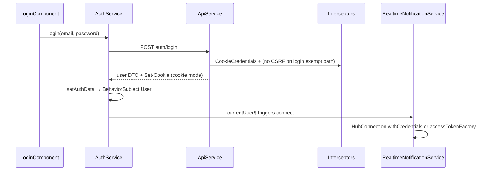
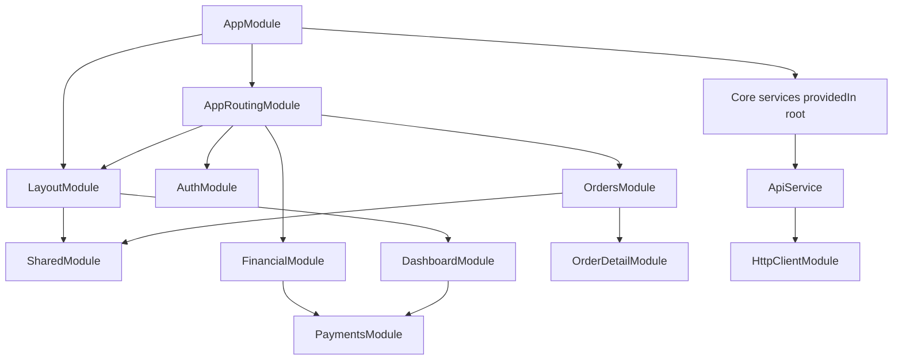

# Frontend Architecture — Angular 15 SPA

**Stack:** Angular 15.2.10 · PrimeNG 15.4 · RxJS 7.5 · SignalR client 10.x · ApexCharts  
**Related:** [SYSTEM_OVERVIEW.md](./SYSTEM_OVERVIEW.md) · [SECURITY_ARCHITECTURE.md](./SECURITY_ARCHITECTURE.md) · [BUSINESS_WORKFLOW_ARCHITECTURE.md](./BUSINESS_WORKFLOW_ARCHITECTURE.md)

---

## 1. Application shell

| Piece | Path | Role |
|-------|------|------|
| Bootstrap | `src/main.ts` | `platformBrowserDynamic().bootstrapModule(AppModule)` |
| Root module | `src/app/app.module.ts` | Global imports, interceptor chain, `MessageService` |
| Root routing | `src/app/app-routing.module.ts` | Top-level lazy routes + guards |
| Root component | `src/app/app.component.ts` | `<router-outlet>`, `<p-toast>`, injects `RealtimeNotificationService` (side-effect connect) |
| Layout | `src/app/layout/` | `MainLayoutComponent` — sidebar, header, notifications, breadcrumbs |

**Path aliases** (`tsconfig.json`): `@core/*`, `@shared/*`, `@environments/*`.

---

## 2. Folder structure

```
Frontend/src/app/
├── app.module.ts / app-routing.module.ts / app.component.*
├── auth/                    # Public auth routes (outside main layout)
├── layout/                  # MainLayoutComponent shell
├── core/                    # Singleton services, guards, interceptors
│   ├── guards/
│   ├── interceptors/
│   ├── services/
│   ├── constants/
│   └── utils/
├── shared/                  # SharedModule, models, pipes, ui-components
├── dashboard/
├── orders/                  # Nested lazy: list, create, detail, file-upload
├── quotes/ invoices/ files/ messages/ notifications/
├── users/ designers/ clients/ permissions/
├── analytics/ financial/ client-intelligence/
├── gallery/ reviews/ settings/ projects/
├── client-pricing/ designer-pricing/
└── payments/                # No app route — imported by dashboard/invoices
```

---

## 3. Routing architecture

### 3.1 Top-level routes

| Path | Load | Guards | `data.roles` |
|------|------|--------|--------------|
| `''` | redirect → `/dashboard` | — | — |
| `auth` | `AuthModule` | none | — |
| `login`, `register`, … | redirect → `/auth/...` | — | — |
| `''` + `MainLayoutComponent` | shell | **AuthGuard** | — |
| `dashboard` | lazy | AuthGuard | — |
| `users` | lazy | AuthGuard + **RoleGuard** | SuperAdmin, Admin |
| `orders` | lazy | AuthGuard | — |
| `quotes` | lazy | RoleGuard | SuperAdmin, Admin, Client |
| `designers` | lazy | RoleGuard | SuperAdmin, Admin |
| `permissions` | lazy | RoleGuard | SuperAdmin |
| `files` | lazy | AuthGuard | — |
| `clients` | lazy | RoleGuard | SuperAdmin, Admin |
| `client-pricing`, `designer-pricing` | lazy | RoleGuard | SuperAdmin, Admin |
| `projects` | lazy | AuthGuard | — |
| `invoices` | lazy | RoleGuard | SuperAdmin, Admin, Client |
| `analytics` | lazy | RoleGuard | SuperAdmin, Admin, Client |
| `financial` | lazy | RoleGuard | SuperAdmin, Admin, Client, Designer |
| `client-intelligence` | lazy | RoleGuard | SuperAdmin, Admin |
| `messages`, `reviews`, `settings`, `notifications` | lazy | AuthGuard | — |
| `gallery` | lazy | RoleGuard | Client |
| `**` | redirect → `/dashboard` | — | — |

### 3.2 Nested lazy modules (orders example)

```
/orders → OrdersModule
  ├── ''           → OrderListModule
  ├── create       → OrderCreateModule
  ├── :orderId/upload → FileUploadModule
  └── :id          → OrderDetailModule
```

### 3.3 Routing flow

```mermaid
flowchart TD
  START[Navigation] --> AUTH{Public /auth?}
  AUTH -->|yes| AUTHMOD[AuthModule<br/>AuthLayoutComponent]
  AUTH -->|no| AG{AuthGuard}
  AG -->|not authenticated| LOGIN[/login?returnUrl=]
  AG -->|ok| LAYOUT[MainLayoutComponent]
  LAYOUT --> RG{RoleGuard on route?}
  RG -->|fail| DASH[/dashboard]
  RG -->|ok| FEAT[Lazy feature module]
  FEAT --> COMP[Feature components]
```

**Note:** `PermissionGuard` exists (`core/guards/permission.guard.ts`) but is **not wired** to `app-routing.module.ts`. Permission UX uses `*appHasPermission` directive instead.

---

## 4. Guards

| Guard | File | Behavior |
|-------|------|----------|
| `AuthGuard` | `core/guards/auth.guard.ts` | `AuthService.isAuthenticated()`; else `/login?returnUrl=` |
| `RoleGuard` | `core/guards/role.guard.ts` | `route.data['roles']` via `hasAnyRole()`; fail → `/dashboard` |
| `PermissionGuard` | `core/guards/permission.guard.ts` | Unused in routes |

**Cookie auth `isAuthenticated()`:** user object present in session storage (tokens not in localStorage).  
**Bearer mode:** valid access token + user, or user + refresh token for silent refresh.

---

## 5. Authentication flow



| Mode | Environments | Token storage | Interceptors |
|------|--------------|---------------|--------------|
| Cookie | development, staging, production | User in **sessionStorage**; JWT in HttpOnly cookies | `CookieCredentialsInterceptor`, `CsrfInterceptor` |
| Bearer | testing, e2e | `localStorage`: auth_token, refresh, expires, user | `TokenInterceptor` (401 → refresh) |

**Logout:** `POST auth/logout` clears cookies server-side; client clears storage; navigates to `/login`.

**Refresh:** `POST auth/refresh-token` — empty body (cookies) or refresh token body (Bearer).

---

## 6. HTTP interceptors (registration order)

Defined in `app.module.ts` — **order matters**:

| # | Interceptor | Purpose |
|---|-------------|---------|
| 1 | `CookieCredentialsInterceptor` | `withCredentials: true` when `useCookieAuth` |
| 2 | `CsrfInterceptor` | Reads `ldp_csrf` → `X-XSRF-TOKEN` on mutating methods |
| 3 | `TokenInterceptor` | Bearer header; 401 refresh/logout |
| 4 | `HttpRequestTrackerInterceptor` | Global loading counter; `SKIP_LOADER_HEADER` |
| 5 | `HttpLoadingErrorInterceptor` | 15s timeout, error toasts, auth redirects |

`error.interceptor.ts` exists but is **not registered** (superseded by loading/error interceptor).

---

## 7. API layer

**Gateway:** `core/services/api.service.ts`

```typescript
// Base URL pattern
`${environment.apiUrl}/api${apiVersion ? '/' + apiVersion : ''}`
```

| Method | Usage |
|--------|-------|
| `get/post/put/patch/delete` | Relative endpoint strings (`orders`, `auth/login`) |
| `getBlob` | PDF / file downloads |
| `extractItems` / `extractPagedMeta` | Normalized list responses |
| `skipLoaderHeaders()` | Background polling without full-screen loader |

**Domain services** wrap `ApiService`: `AuthService`, `NotificationService`, `DashboardService`, analytics/billing services. Large feature components (e.g. `order-detail`) also call `ApiService` directly for feature-specific endpoints.

**No OpenAPI client** — contracts are maintained manually against backend DTOs in `shared/models/`.

---

## 8. State management

| Pattern | Implementation |
|---------|----------------|
| Global store | **None** (no NgRx/Akita) |
| Session user | `AuthService` → `BehaviorSubject<User>` |
| Permissions | `PermissionsService` — cache from `GET users/me/permissions` |
| Notifications | `NotificationService` — unread count + REST; 60s poll fallback |
| Lists | `SharedListDataService` — `shareReplay(1)` per endpoint key |
| Dashboard | `DashboardService` — cached KPIs; invalidated on SignalR order events |
| Component state | Local fields + `takeUntil(destroy$)` on subscriptions |

**Why services over NgRx:** Team convention for Angular 15 codebase size; server is source of truth; reduces boilerplate for CRUD-heavy portal.

---

## 9. SignalR integration

| Item | Detail |
|------|--------|
| Service | `core/services/realtime-notification.service.ts` |
| Hub URL | `(environment.signalRUrl ?? environment.apiUrl) + '/hubs/notifications'` |
| Connect trigger | `authService.currentUser$` — connect on login, disconnect on logout |
| Cookie mode | `withCredentials: true`, no `accessTokenFactory` |
| Bearer mode | `accessTokenFactory` from `getAccessToken()` |
| Events | `ReceiveNotification`; order grid: `OrderCreated`, `OrderAssigned`, `PreviewUploaded`, `OrderStatusChanged`, … |
| Reconnect | `withAutomaticReconnect()`; re-join user group |
| Status | `RealtimeStatusService.isConnected$` |
| Consumers | `main-layout`, `dashboard`, order list refresh |

**Security:** Hub `[Authorize]`; `JoinUserGroup` rejects `userId` ≠ authenticated user id.

---

## 10. Upload flow (frontend)

1. User selects files in order detail / file-upload / quote forms.
2. `FormData` POST to `api/files` or order-specific upload endpoints.
3. Interceptors attach credentials + CSRF on mutating requests.
4. Client-side limits mirrored in `core/constants/upload-limits.ts` (UX validation; server enforces `UploadLimits`).
5. Progress/error via component logic + `HttpLoadingErrorInterceptor` toasts.

Server pipeline: [SECURITY_ARCHITECTURE.md](./SECURITY_ARCHITECTURE.md#upload-security-pipeline).

---

## 11. Environment configuration

| File | Build config | `apiUrl` | `useCookieAuth` |
|------|--------------|----------|-----------------|
| `environment.development.ts` | default serve | `https://localhost:44398` | true |
| `environment.staging.ts` | staging | `https://staging-api.hawkmerchandising.com` | true |
| `environment.production.ts` | production | `https://api.hawkmerchandising.com` | true |
| `environment.testing.ts` | testing / e2e | local API | **false** |
| `environment.ts` | re-exports development | — | — |

`angular.json` `fileReplacements` map production/staging/testing/e2e builds.

---

## 12. PrimeNG usage

| Area | Modules |
|------|---------|
| Global | `ToastModule`, `MessageService` in `AppModule` |
| Layout | `MenuModule`, `SidebarModule`, `BreadcrumbModule`, `OverlayPanelModule` |
| Features | Per-module imports (`TableModule`, `DialogModule`, `DropdownModule`, …) |
| Shared UI | `shared/ui-components/ui-components.module.ts` — wrappers around Button/Dialog/skeletons |

**Charts:** ApexCharts (`ng-apexcharts`) in analytics/financial — complementary to PrimeNG tables.

---

## 13. Shared module strategy

`SharedModule` exports:

- Directives: `*appHasPermission`
- Pipes: `roleName`, `relativeTime`
- `UiComponentsModule`: `PageHeader`, `KpiCard`, `DataTableWrapper`, skeleton components
- Re-exported PrimeNG pieces used by wrappers

Feature modules import `SharedModule` + declare feature-specific PrimeNG modules locally (no central PrimeNG barrel — tree-shaking by convention).

---

## 14. Layout & dashboard architecture

### Layout (`layout/main-layout`)

- Sidebar menu built from role (`AuthService.hasRole`)
- Header: notifications overlay, user menu, realtime connection indicator
- Breadcrumb from route `data.breadcrumb`
- Single `MainLayoutComponent` wrapper prevents sidebar flash on lazy load

### Dashboard (`dashboard/`)

- Role-specific KPI cards and quick actions
- Subscribes to SignalR `orderUpdates$` for live counts
- Uses `DashboardService` + skeleton (`app-skeleton-dashboard`) on first load
- Embeds `PaymentsModule` widgets where billing status is shown

---

## 15. Order management architecture

| Component / module | Responsibility |
|--------------------|----------------|
| `order-list` | Paginated table, filters, SignalR refresh |
| `order-create` | Client/admin create; pricing hints from client pricing API |
| `order-detail` | Lifecycle actions, files, revisions, comments, status timeline |
| `order-progress-timeline` | Visual status history |
| `file-upload` | Dedicated upload route `:orderId/upload` |
| `shared/utils/order-locking.ts` | Client-side lock hints when `AllowUploads` false |

Backend state machine is authoritative — UI only enables buttons for allowed transitions based on API-returned status.

---

## 16. Notification system

| Channel | Implementation |
|---------|----------------|
| In-app REST | `NotificationService` — list, mark read, unread count |
| Realtime | SignalR `ReceiveNotification` → toast or badge increment |
| Polling fallback | 60s interval when `RealtimeStatusService` disconnected |
| Email | Server-side only (`NotificationService` + Hangfire) |

Route: `/notifications` lazy module.

---

## 17. Messaging system

| Piece | Detail |
|-------|--------|
| Route | `/messages` → `MessageListComponent` |
| API | `api/messages` via `ApiService` |
| Model | `shared/models/message.model.ts` |
| Workflow | Admin relay between client and designer; designer does not see client email/company in masked DTOs |

Integrated in order detail for order-scoped threads.

---

## 18. Error handling

| Layer | Behavior |
|-------|----------|
| `HttpLoadingErrorInterceptor` | Maps HTTP status to user-friendly toast; 401 → refresh or logout |
| `LoggerService` | Debug logs when `enableDebugLogging` |
| Components | Try/catch on critical actions; display PrimeNG messages |
| No global error handler service | Errors handled per interceptor + component |

---

## 19. Responsive strategy

- PrimeNG tables with horizontal scroll on narrow viewports
- Layout sidebar collapses on mobile (layout SCSS)
- Playwright `mobile-chrome` project for smoke tests (`e2e/tests/smoke`)
- No separate mobile app — responsive web only

---

## 20. Performance optimizations

| Technique | Location |
|-----------|----------|
| Lazy loading | All feature modules under `MainLayoutComponent` |
| `OnPush` | Select shared/ui components |
| `trackBy` | `core/utils/track-by.utils.ts` in large tables |
| List caching | `SharedListDataService` shareReplay |
| Skeleton-first load | Dashboard, order list, invoice list, analytics |
| Skip loader header | Background notification polling |
| Production build | `build:production` — AOT, tree shaking |

---

## 21. Security considerations (frontend)

| Topic | Guidance |
|-------|----------|
| Guards | UX only — never sole authorization |
| XSS | Avoid `innerHTML` on user content; Angular sanitization default |
| Token storage | Production uses HttpOnly cookies — reduces XSS token theft |
| CSRF | Required for cookie mode on POST/PUT/PATCH/DELETE |
| Sensitive data | Do not log tokens; `enableDebugLogging` false in staging/prod |
| Permission directive | Hides UI; API returns 403 if bypassed |

---

## 22. Frontend module dependency graph



---

## 23. Known gaps (documented for maintainers)

| Gap | Impact |
|-----|--------|
| `PermissionGuard` unused | Route-level permission gates not enforced in router |
| `payments` no top-level route | Deep-link to payments only via dashboard/invoices |
| Large `order-detail` component | Maintainability / testability debt |
| `environment.network.ts` | Manual LAN template; not in `angular.json` replacements |

See [ARCHITECTURE_DECISIONS_AND_TECH_DEBT.md](./ARCHITECTURE_DECISIONS_AND_TECH_DEBT.md).
