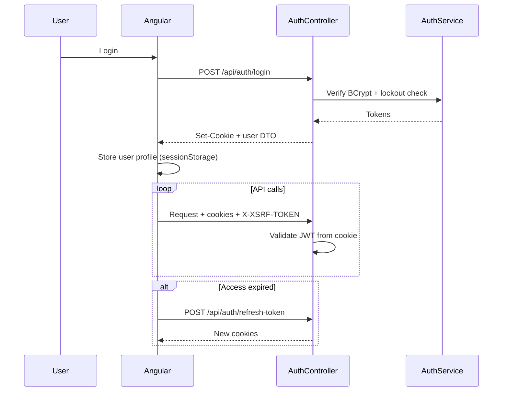
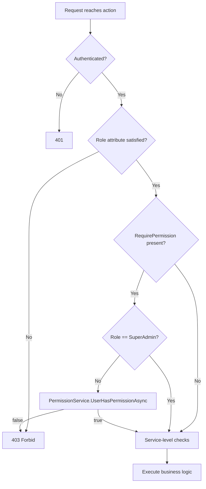
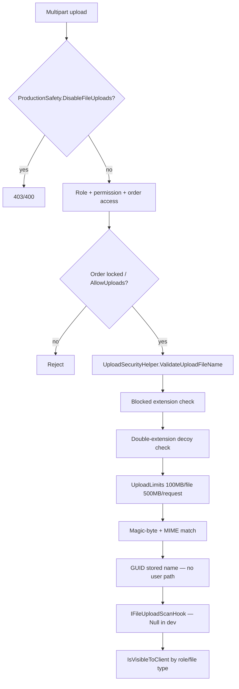

# Security Architecture

**Classification:** Production security design for Logo Design Portal / Hawk Merchandising Web Portal  
**Related:** [SYSTEM_OVERVIEW.md](./SYSTEM_OVERVIEW.md) · [BACKEND_ARCHITECTURE.md](./BACKEND_ARCHITECTURE.md) · [FILE_UPLOAD_SECURITY.md](../FILE_UPLOAD_SECURITY.md)

---

## 1. Security objectives

| Objective | Mechanism |
|-----------|-----------|
| Authenticate users reliably | JWT + optional HttpOnly cookies + refresh rotation |
| Authorize by role and permission | `[Authorize]`, `[RequirePermission]`, service tenant checks |
| Protect cross-tenant data | ClientId scoping + IDOR tests |
| Safe file handling | `UploadSecurityHelper`, non-web-served storage, download authorization |
| Mitigate web attacks | CSRF (cookie mode), security headers, rate limiting, CORS allowlist |
| Operate safely in staging | `ProductionSafetyOptions` kill switches |
| Detect issues | Audit logs, structured logging, health checks |

---

## 2. Authentication model

### 2.1 JWT (HMAC-SHA256)

| Setting | Source | Notes |
|---------|--------|-------|
| `Jwt:Key` | Env / User Secrets | Minimum 32 characters — validated at startup |
| `Jwt:Issuer` / `Audience` | appsettings | Validated on every token |
| Access expiry | 60 min default; 30 min production override | Short-lived access |
| Refresh expiry | 168 hours default | Stored hashed on user + refresh cookie |

**Token creation:** `Infrastructure/Authentication/JwtTokenService.cs`  
**Validation:** `Program.cs` `AddJwtBearer` — `ValidateLifetime`, `ValidateIssuerSigningKey`, 1-minute clock skew.

### 2.2 Cookie-based session (recommended production)

| Cookie | HttpOnly | Purpose |
|--------|----------|---------|
| `ldp_access` | Yes | JWT access token |
| `ldp_refresh` | Yes | Refresh token |
| `ldp_csrf` | **No** | CSRF double-submit readable by SPA |

**Service:** `AuthCookieService` — sets `Secure`, `SameSite=None` (cross-origin SPA), `Path=/`.

**Why cookies + CSRF:** Reduces XSS impact vs localStorage JWT; requires strict CSRF on mutating verbs.

### 2.3 Bearer fallback

Integration tests and E2E API specs send `Authorization: Bearer`. `CsrfValidationMiddleware` **skips** CSRF when Bearer is present. `OnMessageReceived` prefers Bearer over stale cookies.

### 2.4 Password security

| Control | Implementation |
|---------|----------------|
| Hashing | BCrypt via `BCrypt.Net-Next` in `AuthService` |
| Lockout | `FailedLoginAttempts`, `LockoutEnd` on `User` |
| Reset | Time-limited `PasswordResetToken`; emailed via Hangfire or dev console |
| Root admin | `IsRootAdmin` — cannot delete/deactivate/change role |

### 2.5 Session / refresh handling

- Refresh endpoint rotates tokens; invalid/expired refresh → 401.
- Logout clears cookies server-side.
- Tests: `RefreshTokenAndReplayIntegrationTests` — replay protection.

---

## 3. Auth lifecycle

---

## 4. Authorization architecture

### 4.1 Layers

| Layer | Enforcement |
|-------|-------------|
| Controller | `[Authorize(Roles = "...")]`, `[AllowAnonymous]` for webhooks/login |
| Permission filter | `[RequirePermission("UploadFile")]` — SuperAdmin bypass |
| Service | Order/invoice/file access by `ClientId`, assignment, admin override |
| DTO | Field nulling/masking by role |

### 4.2 Permission evaluation flow

### 4.3 Role-based access matrix (summary)

| Resource | Client | Designer | Admin | SuperAdmin |
|----------|--------|----------|-------|------------|
| Own orders | Yes | Assigned only | All | All |
| All orders list | No | No | Yes | Yes |
| Assign designer | No | No | Yes | Yes |
| Permissions UI | No | No | No | Yes |
| Designer payout | No | Limited | Yes | Yes |
| Invoices | Own | No | Yes | Yes |

---

## 5. DTO masking

Implemented in `OrderService`, `FileService`, `MessageService`, `CommentService`:

| Viewer | Hidden / substituted |
|--------|---------------------|
| Client | Designer name → `"Company Design Team"`; designer ids nulled |
| Designer | Client company, contact email, billing identifiers |
| Admin | Full visibility for operations |

**Implication:** New sensitive fields must be masked in **every** response path, not only list endpoints.

---

## 6. Upload security pipeline

### 6.1 Controls detail

| Control | Location |
|---------|----------|
| Blocked extensions | `.exe`, `.php`, `.html`, `.ps1`, … — `BlockedExtensions` |
| Path traversal | Reject `..` in filename |
| MIME validation | `AllowedMimeByExtension` + content sniff |
| Magic bytes | JPEG, PNG, GIF, WebP, PDF, SVG |
| Storage | Outside wwwroot; IIS must not expose `Files/` as static |
| Download IDOR | `FileService.DownloadFileAsync` — client cannot fetch hidden previews |
| Malware scan | `IFileUploadScanHook` — `NullFileUploadScanHook` default; plug ClamAV/cloud in prod |

---

## 7. API protection

| Control | Detail |
|---------|--------|
| HTTPS | `UseHttpsRedirection` non-Development |
| HSTS | `SecurityHeadersMiddleware` |
| CSP | Report-only CSP in security headers |
| CORS | Explicit origin list; `AllowCredentials()` for cookies |
| Rate limiting | `RateLimitingMiddleware` — Redis-backed; stricter on auth endpoints |
| Swagger | **Development only** — not registered in Staging/Production |
| Exception detail | `IncludeExceptionDetailsInProduction: false` on staging |
| Input sanitization | `InputSanitizationMiddleware` **disabled** (stream handling debt) |

---

## 8. Anti-forgery (CSRF)

**Model:** Double-submit cookie (`ldp_csrf` + `X-XSRF-TOKEN`).

**Middleware:** `CsrfValidationMiddleware` — runs after authentication.

**Exempt paths:** login, register, refresh, forgot/reset password, `/health`, `/hubs`.

**Exempt auth mode:** Bearer header present.

**Frontend:** `CsrfInterceptor` copies cookie to header on POST/PUT/PATCH/DELETE.

---

## 9. SignalR security

| Control | Detail |
|---------|--------|
| Hub authorization | `[Authorize]` on `NotificationHub` |
| Group join | `JoinUserGroup(userId)` must match `Context.UserIdentifier` |
| Token delivery | `access_token` query for WebSocket (no custom headers) |
| Cookie mode | Cookies sent with `withCredentials` — no query token needed |

---

## 10. Environment secrets

| Environment | Secret storage |
|-------------|----------------|
| Development | .NET User Secrets (`UserSecretsId` on API csproj) |
| Staging/Production | IIS `web.config` environment variables or secret manager — **never commit** |
| Validation | `ProductionSecretsValidator` rejects placeholder JWT keys in non-Development |

See `docs/SECRET_MANAGEMENT_GUIDE.md`.

---

## 11. Staging vs production security

| Aspect | Staging | Production |
|--------|---------|------------|
| Hosts | `staging-*.hawkmerchandising.com` | Production hosts |
| Billing | `ProductionSafety` disables auto billing/payout by default | Full financial ops |
| Payments | `UseTestMode: true` | Live providers |
| Redis | Required (no in-memory fallback) | Required |
| CORS | HTTPS staging admin origin only | Production SPA origins |

---

## 12. Redis / session considerations

Redis stores **cache, rate limits, SignalR backplane, Hangfire** — not end-user HTTP sessions. JWT/cookies remain stateless across API nodes.

**Risk:** Redis compromise exposes cached read models (business metadata) — network isolate Redis, auth password, TLS in cloud.

---

## 13. Logging and security auditing

| Signal | Mechanism |
|--------|-----------|
| Request audit | Serilog with UserId, Role, CorrelationId, OrderId route values |
| Security events | `AuditLogService` for sensitive admin actions |
| Failed auth | Logged in `AuthService` / lockout counters |
| Health | No sensitive data in `/health` JSON responses |

---

## 14. Error exposure prevention

- `ExceptionMiddleware` returns generic messages in production.
- Stack traces only when explicitly allowed for environment.
- 404 vs 403 on cross-tenant: prefer **404** where enumeration is a risk (documented in IDOR tests).

---

## 15. Known risks

| Risk | Severity | Notes |
|------|----------|-------|
| Symmetric JWT key | Medium | Single key compromise affects all tokens — rotate via deployment |
| `InputSanitizationMiddleware` disabled | Medium | Rely on output encoding + validation; re-enable with safe stream handling |
| Local file storage | Medium | Multi-instance needs shared volume or object storage |
| `NullFileUploadScanHook` | High in prod if not replaced | No malware scanning until hook implemented |
| PermissionGuard unused on frontend routes | Low | API still enforces |
| `SystemController` anonymous | Low | Ensure no sensitive data on ops endpoints |
| SVG uploads | Medium | SVG/XML can carry script — serve with caution; magic-byte check exists |

---

## 16. Recommended improvements

1. Deploy **ClamAV or cloud scanning** via `IFileUploadScanHook` in production.
2. Re-enable **input sanitization** with request body buffering strategy that does not break multipart.
3. Move JWT to **asymmetric signing** (RSA) if third-party services must validate tokens.
4. Add **Content-Disposition: attachment** on downloads; `X-Content-Type-Options: nosniff`.
5. Wire **PermissionGuard** on sensitive Angular routes for defense in depth.
6. **Secrets rotation** runbook automation (JWT, SMTP, payment webhooks).
7. **WAF** in front of IIS for production (see `docs/IIS_HARDENING_GUIDE.md`).

---

## 17. Production hardening checklist

- [ ] `Jwt:Key` ≥ 32 chars from secret manager; not placeholder
- [ ] `ConnectionStrings:Redis` configured; `AllowInMemoryFallback: false`
- [ ] CORS origins HTTPS-only; no wildcard with credentials
- [ ] `AuthCookies:Secure: true`, `SameSite` appropriate for deployment topology
- [ ] `FileStorage:Path` outside web root; ACLs restricted
- [ ] Upload scan hook implemented
- [ ] Swagger disabled (non-Development)
- [ ] `IncludeExceptionDetailsInProduction: false`
- [ ] Rate limiting enabled with Redis
- [ ] Hangfire dashboard restricted to admin roles
- [ ] TLS 1.2+ on IIS; HSTS enabled
- [ ] Database least-privilege user (not root)
- [ ] Backups encrypted; restore tested
- [ ] CI security tests green (`CsrfCookieAuth`, `IdorAndCrossTenant`, file download security)

See also `docs/PRODUCTION_SECURITY_CHECKLIST.md`, `docs/FINAL_SECURITY_AUDIT.md`.
