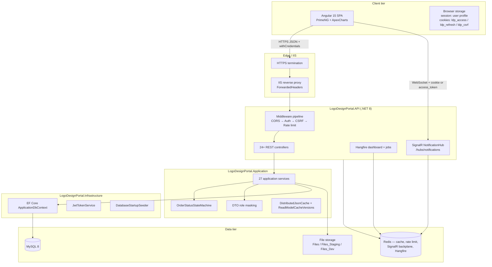
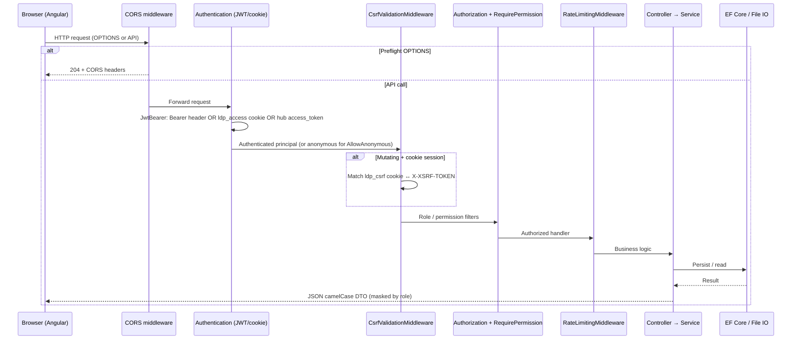
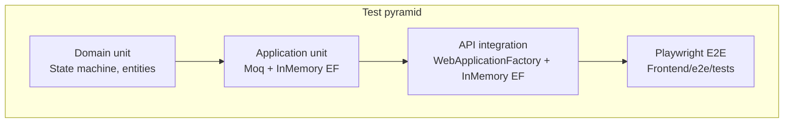

# System Overview — Logo Design Portal / Hawk Merchandising Web Portal

**Document scope:** Canonical implementation under `Backend/src/` and `Frontend/`.  
**Related docs:** [ARCHITECTURE_INDEX.md](./ARCHITECTURE_INDEX.md) · [BACKEND_ARCHITECTURE.md](./BACKEND_ARCHITECTURE.md) · [FRONTEND_ARCHITECTURE.md](./FRONTEND_ARCHITECTURE.md) · [SECURITY_ARCHITECTURE.md](./SECURITY_ARCHITECTURE.md)

**Last verified against codebase:** May 2026 (staging branch architecture)

---

## 1. Platform purpose

The **Logo Design Portal** (branded **Hawk Merchandising Web Portal**) is a B2B operations platform for outsourced logo and merchandising design work. It coordinates:

| Stakeholder | Primary goals |
|-------------|---------------|
| **Clients** | Submit orders/quotes, upload briefs, review previews, request revisions, pay invoices, view gallery |
| **Designers** | Receive assignments, upload previews/finals, propose payout pricing, message via admin relay |
| **Admins / SuperAdmin** | Approve orders, assign designers, mediate workflow, billing, analytics, user/permission management |
| **Operations** | Invoicing (USD client charges), designer payouts (PKR-centric), audit trails, production safety during deploys |

The system enforces a **mediated workflow**: clients never see designer identity; designers never see client PII in order/file/message DTOs. Enforcement is **server-side** in Application services, not in Angular guards alone.

---

## 2. Major modules

| Module | Backend surface | Frontend route(s) |
|--------|-----------------|-------------------|
| Authentication | `AuthController` (`api/auth`) | `/auth/*` |
| Users & roles | `UsersController`, `RolesController`, `PermissionsController` | `/users`, `/permissions` |
| Orders & lifecycle | `OrdersController`, state machine | `/orders/*` |
| Quotes (pre-order) | `QuotesController` | `/quotes` |
| Files & uploads | `FilesController` | `/files`, order upload child routes |
| Revisions | `RevisionsController` | Order detail workflow |
| Comments & messages | `CommentsController`, `MessagesController` | Order detail, `/messages` |
| Notifications (in-app + email) | `NotificationsController`, SignalR hub | `/notifications`, header bell |
| Invoices & billing | `InvoicesController`, `BillingController` | `/invoices`, billing in dashboard |
| Payments | `PaymentsController` (webhooks) | Embedded in invoices/dashboard (`payments` module, no top-level route) |
| Designer payout | `DesignerPayoutController`, `DesignerInvoiceController` | `/financial/designer-payout` |
| Pricing tables | `ClientLogoPricingController`, `DesignerLogoPricingController` | `/client-pricing`, `/designer-pricing` |
| Analytics & intelligence | `Admin/*` controllers | `/analytics`, `/client-intelligence`, `/financial` |
| Gallery | `GalleryController` | `/gallery` (Client only) |
| Settings & audit | `SettingsController`, `AuditLogsController` | `/settings`, audit (SuperAdmin) |
| Reviews | `ReviewsController` | `/reviews` |
| Projects | *(legacy/auxiliary)* | `/projects` |
| Health & ops | `/health`, `/health/ready`, `SystemController` | N/A |

---

## 3. User roles

| Role | Enum / claim | Typical capabilities |
|------|--------------|----------------------|
| **Client** | `Client` | Create orders/quotes, approve previews, pay invoices, gallery |
| **Designer** | `Designer` | Assigned orders, uploads, payout pricing, no client PII |
| **Admin** | `Admin` | Full operational control except permission matrix edits |
| **SuperAdmin** | `SuperAdmin` | All permissions; bypasses `[RequirePermission]` checks |

Granular **permissions** (16 seeded names such as `CreateOrder`, `AssignOrder`, `UploadFile`) supplement roles on selected endpoints via `[RequirePermission]`.

---

## 4. High-level architecture



**Why this shape:** Clean Architecture separates domain rules (state machine) from orchestration (services) and I/O (EF, files, email). The API host owns cross-cutting HTTP concerns (CSRF, rate limits, SignalR, Hangfire) so Application stays testable without ASP.NET references in business logic.

---

## 5. Request lifecycle



**Ordering rationale** (`Program.cs`): CORS before auth so OPTIONS never receives 401; CSRF after authentication so only cookie-bound sessions are validated; rate limiting after auth to attribute abuse to users where possible.

---

## 6. Frontend / backend interaction

| Concern | Implementation |
|---------|----------------|
| API base | `{environment.apiUrl}/api` via `ApiService` |
| JSON contract | camelCase enums as strings; matches `Program.cs` `JsonSerializerOptions` |
| Auth (prod/staging/dev) | `useCookieAuth: true` — HttpOnly `ldp_access` / `ldp_refresh`; CSRF double-submit |
| Auth (E2E/testing build) | Bearer tokens in `localStorage` for Playwright/API specs |
| Realtime | `@microsoft/signalr` → `/hubs/notifications`; cookie credentials or `access_token` query |
| Loading UX | Interceptors: credentials, CSRF, token refresh, 15s timeout, selective skeletons |
| Permissions UI | `PermissionsService` + `*appHasPermission` directive (UX only; API re-validates) |

See [FRONTEND_ARCHITECTURE.md](./FRONTEND_ARCHITECTURE.md) for module and interceptor detail.

---

## 7. Deployment model

| Environment | API host | SPA | Database | File root |
|-------------|----------|-----|----------|-----------|
| Development | Kestrel / IIS Express, User Secrets | `ng serve`, `environment.development.ts` | Local MySQL | `Files_Dev` |
| Testing | `ASPNETCORE_ENVIRONMENT=Testing` | `ng build --configuration=testing` | SQLite / InMemory in tests | `Files_Test` |
| Staging | IIS `staging-api.hawkmerchandising.com` | `build:staging` → `staging-admin.hawkmerchandising.com` | Dedicated MySQL | `Files_Staging` |
| Production | IIS `api.hawkmerchandising.com` | `build:production` | Production MySQL | `Files` |

- **Migrations:** `DatabaseInitializationHostedService` when `Database:RunAfterStartup` is true (dev); **false on staging/production** — migrations run in release pipeline.
- **Redis:** Required when `Scalability:AllowInMemoryFallback` is false (staging/production default).
- **Artifacts:** `.github/workflows/deploy-artifacts.yml` publishes API zip + frontend dist on version tags.

See [ENVIRONMENT_AND_DEPLOYMENT_ARCHITECTURE.md](./ENVIRONMENT_AND_DEPLOYMENT_ARCHITECTURE.md).

---

## 8. Security philosophy

| Principle | How it is applied |
|-----------|-------------------|
| **Fail closed** | Missing `IPermissionService` → 403; invalid CSRF → 403; production secret placeholders → startup failure |
| **Defense in depth** | Roles on controllers + service-level tenant checks + DTO masking + upload pipeline |
| **Never trust the client** | Angular `RoleGuard` is UX; all mutations re-checked in services |
| **Least exposure** | Swagger Development-only; exception details off in staging/production; files not served as static wwwroot |
| **Cookie hardening** | HttpOnly access/refresh; separate CSRF cookie; `SameSite=None` + `Secure` for cross-site SPA |
| **Kill switches** | `ProductionSafetyOptions` disables billing/payout/uploads during risky deploys |

See [SECURITY_ARCHITECTURE.md](./SECURITY_ARCHITECTURE.md).

---

## 9. Environment separation

| Layer | Mechanism |
|-------|-----------|
| ASP.NET | `ASPNETCORE_ENVIRONMENT` → `appsettings.{Environment}.json` + environment variables |
| Validation | `ProductionSecretsValidator`, `EnvironmentConfigurationValidator` at startup |
| Frontend | `angular.json` `fileReplacements` per configuration |
| Data | Separate connection strings and `FileStorage:Path` per environment |
| Staging safety | Default `ProductionSafety` disables billing generation and designer payout |

---

## 10. Testing strategy



| Layer | Project / location | CI workflow |
|-------|------------------|-------------|
| Domain | `LogoDesignPortal.Domain.Tests` | `test.yml`, `pr-validation.yml` |
| Application | `LogoDesignPortal.Application.Tests` | `test.yml`, `pr-validation.yml` |
| Integration | `LogoDesignPortal.API.IntegrationTests` `[Collection("Integration")]` | `test.yml` (80% line gate) |
| E2E | `Frontend/e2e/` | `test.yml` smoke; `e2e-playwright.yml` full + MySQL |

See [TESTING_ARCHITECTURE.md](./TESTING_ARCHITECTURE.md).

---

## 11. Architectural principles

1. **Canonical backend path:** Only `Backend/src/` — legacy folders outside `src` are excluded from solution and documentation.
2. **State machine authority:** All order status changes go through `OrderStatusStateMachine` / `OrderStatusTransitionHelper`.
3. **Service-oriented application layer:** No CQRS/MediatR; explicit service classes registered in `DependencyInjection.cs`.
4. **Direct EF access:** Services use `IApplicationDbContext`; `IRepository<T>` exists but is unused.
5. **Role-masked DTOs:** Mapping and nulling happen in services (`OrderService`, `FileService`, `MessageService`, `CommentService`).
6. **Scalable realtime and jobs:** Redis backplane for SignalR; Hangfire for email and maintenance when Redis is configured.
7. **Observable operations:** Serilog structured logs, correlation IDs, health checks (`/health`, `/health/ready`, `/health/live`), optional OpenTelemetry.
8. **Agent/human standards:** `.cursor/rules/architecture.mdc` and `testing.mdc` codify non-negotiables for changes.

---

## 12. Solution structure

```
Backend/src/
├── LogoDesignPortal.Domain/          # Entities, enums, OrderStatusStateMachine
├── LogoDesignPortal.Application/     # Services, DTOs, helpers, interfaces
├── LogoDesignPortal.Infrastructure/  # EF Core, JWT, migrations, seeding
├── LogoDesignPortal.API/             # HTTP host, middleware, hubs, Hangfire
├── LogoDesignPortal.Domain.Tests/
├── LogoDesignPortal.Application.Tests/
└── LogoDesignPortal.API.IntegrationTests/

Frontend/
├── src/app/                          # Feature modules + core + shared + layout
├── src/environments/                 # Per-build API URLs and auth mode
└── e2e/                              # Playwright tests and POM
```

---

## 13. Cross-references

| Topic | Document |
|-------|----------|
| Layering & services | [BACKEND_ARCHITECTURE.md](./BACKEND_ARCHITECTURE.md) |
| Angular modules & auth | [FRONTEND_ARCHITECTURE.md](./FRONTEND_ARCHITECTURE.md) |
| Schema & migrations | [DATABASE_ARCHITECTURE.md](./DATABASE_ARCHITECTURE.md) |
| Auth, CSRF, uploads | [SECURITY_ARCHITECTURE.md](./SECURITY_ARCHITECTURE.md) |
| Order/invoice flows | [BUSINESS_WORKFLOW_ARCHITECTURE.md](./BUSINESS_WORKFLOW_ARCHITECTURE.md) |
| Tech debt & roadmap | [ARCHITECTURE_DECISIONS_AND_TECH_DEBT.md](./ARCHITECTURE_DECISIONS_AND_TECH_DEBT.md) |
| Package inventory | [COMPLETE_TECH_STACK_REFERENCE.md](./COMPLETE_TECH_STACK_REFERENCE.md) |
| Onboarding summary | [../UPDATED_ARCHITECTURE_ONBOARDING.md](../UPDATED_ARCHITECTURE_ONBOARDING.md) |
