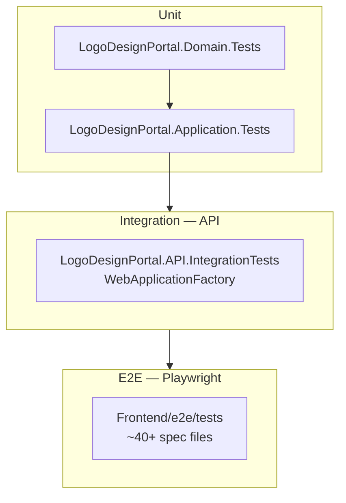
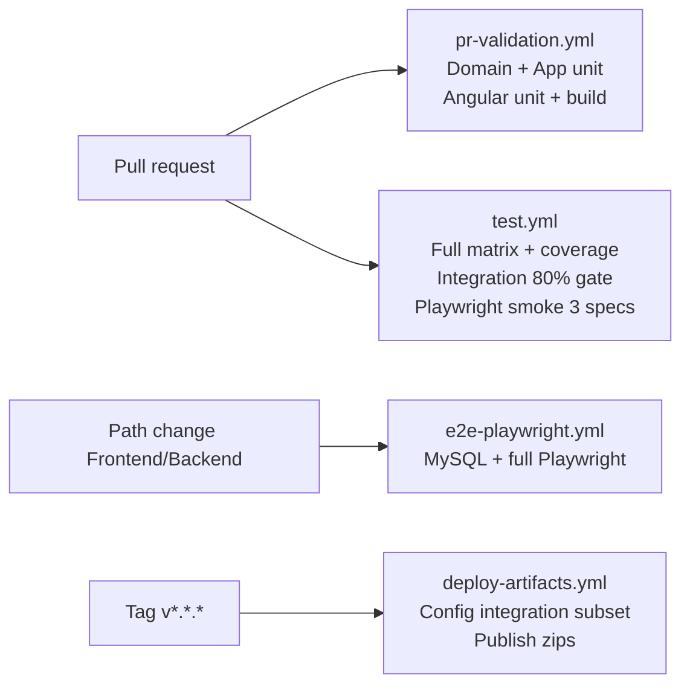

# Testing Architecture

**Related:** [SYSTEM_OVERVIEW.md](./SYSTEM_OVERVIEW.md) · [SECURITY_ARCHITECTURE.md](./SECURITY_ARCHITECTURE.md) · `.cursor/rules/testing.mdc`

---

## 1. Test pyramid



| Layer | Speed | Fidelity | Count (approx) |
|-------|-------|----------|----------------|
| Domain unit | Fastest | Pure rules | Small suite |
| Application unit | Fast | Mocked IO | ~30+ test classes |
| API integration | Medium | Full HTTP pipeline | ~27 collected classes |
| Playwright E2E | Slowest | Browser + API | Broad workflow/security |

---

## 2. Backend unit testing

### 2.1 `LogoDesignPortal.Domain.Tests`

| Test class | Focus |
|------------|-------|
| `OrderStatusStateMachineTests` | All allowed/forbidden transitions |
| `OrderStatusStateMachineRegressionTests` | Regression guards |
| `EntityDefaultsTests` | Entity invariants |

**Pattern:** No DI; direct static calls on state machine.

### 2.2 `LogoDesignPortal.Application.Tests`

| Area | Examples |
|------|----------|
| `Services/` | `AuthServiceTests`, `OrderService*`, `FileService*`, `PaymentService*` |
| `Helpers/` | `UploadSecurityHelperTests` |
| `Caching/` | `ReadModelCacheVersionsTests` |
| `Regression/` | Cross-service regression |

**Pattern:** Moq `IApplicationDbContext` and interfaces; AAA structure; InMemory EF where integration of queries matters.

---

## 3. API integration testing

### 3.1 Infrastructure

| Component | Path | Role |
|-----------|------|------|
| `TestWebApplicationFactory` | `IntegrationTests/TestWebApplicationFactory.cs` | `WebApplicationFactory<Program>`, env `Testing` |
| `IntegrationCollection` | `IntegrationCollection.cs` | `[Collection("Integration")]` — shared factory |
| `TestDataSeeder` | `TestDataSeeder.cs` | Seeds test users on host start |
| `IntegrationDatabaseHelper` | `IntegrationDatabaseHelper.cs` | Direct EF inserts for edge cases |
| `AuthHelper` | `Helpers/AuthHelper.cs` | JWT login helpers |
| `CookieAuthHelper` | `Helpers/CookieAuthHelper.cs` | Cookie + CSRF session |
| `IntegrationTestJson` | `Helpers/IntegrationTestJson.cs` | camelCase + enum JSON options |
| Factories | `Support/Factories/` | Orders, users, files |

### 3.2 Database isolation

- EF **InMemory** database per factory instance: `IntegrationTestDb_{guid}`
- **Not** shared with production MySQL
- Parallelism limited by `[Collection("Integration")]` serialization

### 3.3 Test layout

| Folder | Coverage |
|--------|----------|
| `Controllers/` | Orders auth/privacy/concurrency, files upload/download, invoices, payments, revisions, users, designer payout |
| `Security/` | JWT, CSRF, refresh replay, IDOR, Swagger exposure, production config |
| `Regression/` | Invoice duplicate mark-paid, order/file workflows |
| `Health/` | `/health` endpoints |
| `Configuration/` | CORS, appsettings validation (some outside Integration collection) |

### 3.4 Auth testing patterns

| Pattern | Use when |
|---------|----------|
| `AuthHelper.GetClientTokenAsync` | Bearer-only API tests |
| `CookieAuthHelper` | CSRF + cookie auth regression |
| Separate `HttpClient` per role | Cross-tenant authorization tests |
| No auth header | Expect 401 |

**Seeded credentials:** `client@test.com`, `admin@test.com`, `designer@test.com`, `superadmin@test.com` — password `Test@123`.

---

## 4. Playwright E2E architecture

### 4.1 Structure

```
Frontend/e2e/
├── playwright.config.ts
├── tests/
│   ├── auth/           # login, session, token expiry API
│   ├── security/       # RBAC, IDOR, hidden data
│   ├── workflows/      # order lifecycle, payments
│   ├── smoke/          # mobile-chrome smoke
│   ├── roles/admin/    # admin storageState project
│   └── ...
├── pom/                # Page objects
├── utils/              # api-client, env, role-session
├── commands/           # auth.commands
└── fixtures/           # upload fixtures
```

### 4.2 Config highlights (`e2e/playwright.config.ts`)

| Setting | Value |
|---------|-------|
| `baseURL` | `http://localhost:4200` |
| Projects | `setup`, `admin-chromium`, `chromium`, `mobile-chrome` (smoke) |
| CI workers | Capped 2–4 |
| Retries | 2 on CI |
| `webServer` | Auto `ng serve --configuration=e2e` locally; disabled in CI |

### 4.3 Auth modes in E2E

| Mode | Build | API auth |
|------|-------|----------|
| UI tests | `environment.e2e.ts` → testing | `storageState` from `auth.setup.ts` |
| API specs | `request` fixture | `api-client.ts` JWT login |

---

## 5. CI testing flow



### 5.1 Workflow summary

| Workflow | Trigger | Backend | Frontend |
|----------|---------|---------|----------|
| `pr-validation.yml` | PR to main/develop | Format, build, Domain + Application tests | tsc, Karma, prod build |
| `test.yml` | PR + push main/develop | Matrix: domain, application, integration + Coverlet | Karma CI, prod build, smoke E2E |
| `e2e-playwright.yml` | Path filter / dispatch | API on MySQL 8 service | Full `npm run e2e` |
| `deploy-artifacts.yml` | Tags `v*.*.*` | Filtered integration + publish | dist zip |

### 5.2 Coverage gates

| Project | Runsettings | Threshold |
|---------|-------------|-----------|
| Integration | `Backend/coverlet.runsettings` | **80% line** (enforced in CI) |
| Domain | `coverlet.domain.runsettings` | 80% configured |
| Application | `coverlet.application.runsettings` | 80% configured |

---

## 6. Deterministic testing strategy

| Technique | Where |
|-----------|-------|
| Fixed seed users | `TestDataSeeder` |
| InMemory DB per factory | No shared MySQL in integration |
| `IntegrationTestJson.Options` | Consistent deserialization |
| Null Hangfire | `Testing` environment → `NullBackgroundJobScheduler` |
| No SignalR Redis in Testing | Backplane skipped in `Program.cs` |
| Playwright retries | Flake mitigation on CI |

**Avoid:** time-of-day assertions; use injected clocks where needed (prefer UTC in domain).

---

## 7. Critical scenarios covered

| Domain | Tests |
|--------|-------|
| Auth | 401/403, lockout, refresh replay, CSRF cookie |
| Orders | State machine illegal transitions, concurrency, role masking |
| Files | Upload security, download IDOR, visibility |
| Invoices/payments | Mark-paid duplicate, cross-tenant invoice access |
| Permissions | `[RequirePermission]` enforcement |
| Config | Production secret validation, CORS |

---

## 8. Missing coverage areas (gaps)

| Gap | Risk | Mitigation |
|-----|------|------------|
| Hangfire job outcomes | Medium | Add integration tests with test server + Hangfire memory |
| SignalR hub multi-client | Medium | Manual / future hub integration tests |
| Full PayPal webhook edge cases | Medium | Expand `PaymentsController` webhook tests |
| Load/stress | High at scale | `docs/LOAD_TESTING_PLAN.md` — not in CI |
| Mutation testing | Low | Stryker configured but not in default CI |
| PermissionGuard routes | Low | E2E RBAC covers some paths |
| ClamAV hook | High if prod without scan | Operational checklist |

See `docs/TEST_COVERAGE_GAP_REPORT.md`.

---

## 9. Module QA documentation

| Module | Guides |
|--------|--------|
| Orders/files/auth | `docs/TESTING_ORDER_FILE_AUTH_MODULE.md`, `docs/QA_ORDER_FILE_AUTH_MODULE.md` |
| Invoice/payment/revision | `docs/TESTING_INVOICE_PAYMENT_REVISION_MODULE.md` |
| Designer payout | `docs/TESTING_DESIGNER_PAYOUT_MODULE.md` |

---

## 10. Environment testing strategy

| Environment variable | Testing use |
|---------------------|-------------|
| `ASPNETCORE_ENVIRONMENT=Testing` | Integration factory |
| `appsettings.Testing.json` | SQLite, test JWT, lax cookies |
| `ng build --configuration=testing` | Bearer auth for E2E API |
| `ng build --configuration=e2e` | E2E serve build |

---

## 11. Smoke testing

| Suite | Command | CI |
|-------|---------|-----|
| Playwright smoke | `npm run e2e:smoke` | `test.yml` — login, unauthorized, rbac (3 specs) |
| Health | Integration `Health/*` | `test.yml` |
| Deploy smoke | Csrf, Cors, ProductionConfiguration | `deploy-artifacts.yml` |

---

## 12. Agent / developer rules

From `.cursor/rules/testing.mdc` — when touching features, add:

- Domain + Application unit tests
- Integration tests with `[Collection("Integration")]`
- Playwright E2E for user-visible workflows
- Permission tests (403) and security tests (IDOR, CSRF)
- Negative and concurrency tests where applicable

**Never** weaken assertions to fix flakes — fix root cause.
