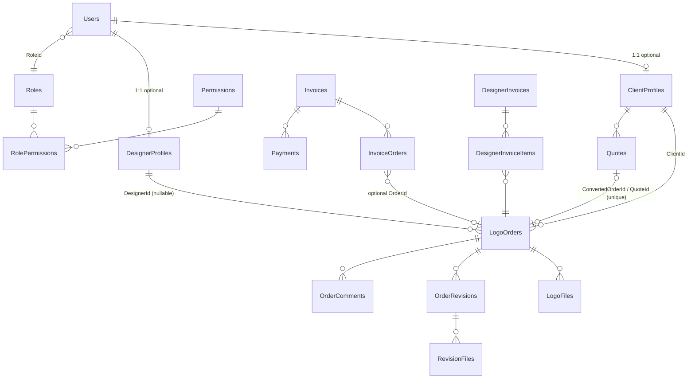

# Database Overview

Verified from `Backend/src/LogoDesignPortal.Infrastructure/Persistence/` and `Migrations/`. A deeper historical reference exists at `docs/architecture/DATABASE_ARCHITECTURE.md`.

## Engine and provider

- **Production/Staging**: MySQL 8 via Pomelo EF Core provider (`UseMySql`, server version 8.0.21, retry-on-failure ×5, 120 s command timeout)
- **Local/tests**: SQLite when the connection string contains `Data Source=` or `.db`; EF InMemory in integration tests
- Connection string name: `DefaultConnection` (env var `ConnectionStrings__DefaultConnection`)
- Single context: `ApplicationDbContext` (also registered as `IApplicationDbContext`); migrations assembly `LogoDesignPortal.Infrastructure`
- `SlowQueryLoggingInterceptor` logs slow queries

## Tables (EF DbSets, default plural names)

| Area | Tables |
|---|---|
| Identity & access | `Users`, `Roles`, `Permissions`, `RolePermissions` |
| Profiles | `ClientProfiles`, `DesignerProfiles` |
| Orders | `LogoOrders`, `LogoFiles`, `OrderRevisions`, `RevisionFiles`, `OrderComments`, `OrderStatusHistories`, `OrderLogs` |
| Quotes | `Quotes` |
| Client billing | `Invoices`, `InvoiceOrders`, `InvoiceLogs`, `Payments` |
| Designer payout | `DesignerInvoices`, `DesignerInvoiceItems`, `DesignerInvoiceAdjustments` |
| Pricing | `DesignPricings`, `ClientLogoPricings`, `DesignerLogoPricings` |
| Communication | `Messages`, `Notifications`, `Reviews` |
| Misc | `ClientGalleries`, `Settings`, `AuditLogs` |

## Key entity relationships



## Conventions and notable configuration

- **Base entity**: every table has `Id`, `CreatedAt`, `UpdatedAt`, `CreatedBy`, `UpdatedBy`, `IsDeleted`, `DeletedAt`, `DeletedBy`. `SaveChangesAsync` stamps timestamps automatically.
- **Soft delete**: global query filters on `Users`, `LogoOrders`, `LogoFiles`, `Invoices`, `ClientProfiles`, `DesignerProfiles`, `OrderComments`, `Settings`, `ClientGalleries`, `AuditLogs`, `DesignerLogoPricings`, `Quotes`. Hard deletes are exceptional.
- **Concurrency**: `RowVersion` tokens on `LogoOrders` and `Invoices` (MySQL `timestamp(6)`).
- **Indexes** (highlights): unique `Users.Email`; unique `(RoleId, PermissionId)`; unique `Invoices.InvoiceNumber`; unique `LogoOrders.QuoteId`; analytics/billing indexes on `LogoOrders` status/date columns; `LogoFiles(OrderId)`, `LogoFiles(PreviewBatchId)`; `Notifications(UserId, IsRead)`.
- **Money/currency**: client amounts stored with `CurrencyCode` (ISO, default USD); designer payout amounts are PKR. Invoices snapshot `ExchangeRate`, `ExchangeRateFetchedAt`, `ExchangeRateIsStale` at issuance (migration `20260609233733`).
- 30 entity configuration classes under `Persistence/Configurations/` define precision, max lengths, and FK delete behaviors.

## Enums stored in the database

`OrderStatus` (see [architecture.md](architecture.md) for the state machine), `QuoteStatus`, `InvoiceStatus` (Pending/Paid/Due/Overdue), `DesignerInvoiceStatus`, `PaymentStatus`, `PriceApprovalStatus`, `BillingType` (PerLogo/Weekly/Monthly/Manual), `FileType`/`FileCategory`/`FileStatus`, `CommentType`, `NotificationType`, `DesignCategory`/`DesignType`, `CustomerType`, `OrderSource`, `OrderPriority`.

## Migrations

48 migrations in `Backend/src/LogoDesignPortal.Infrastructure/Migrations/`, from `20260205182456_InitialCreate` to `20260609233733_AddInvoiceExchangeRateColumns`. Recent ones:

| Migration | Change |
|---|---|
| `20260609233733_AddInvoiceExchangeRateColumns` | Exchange-rate snapshot columns on `Invoices` |
| `20260525233554_AddOrderApprovedAndAssignedTimestamps` | `ApprovedAt`/`AssignedAt` on orders |
| `20260522234016_AddClientAndQuoteCurrencyCode` | `CurrencyCode` on client profiles and quotes |
| `20260521204158_SyncPendingModelChanges` | Model sync |
| `20260521172138_AddWeek3QueryPerformanceIndexes` | Performance indexes |

### Creating migrations

```bash
cd Backend/src/LogoDesignPortal.Infrastructure
dotnet ef migrations add {Name} --startup-project ../LogoDesignPortal.API
```

Never hand-edit migration files or `ApplicationDbContextModelSnapshot.cs`.

### Applying migrations — per environment

| Environment | Mechanism |
|---|---|
| Development | `DatabaseInitializationHostedService` applies `MigrateAsync()` automatically after startup (`Database:RunAfterStartup=true`), then seeds roles/permissions/SuperAdmin |
| Testing / integration tests | `EnsureCreated()` on InMemory/SQLite — no migrations |
| Staging | **Manual**, at release time (`RunAfterStartup=false`) |
| Production | **Manual**, during a maintenance window, after a backup (`RunAfterStartup=false`) — never automatic |

Manual application options (see `Backend/PRODUCTION_MIGRATION_GUIDE.md` and `docs/PRODUCTION-MIGRATION-SAFETY.md`):

1. `Backend/scripts/ApplyAllMigrations.sql` — idempotent full script (preferred for prod; `Backend/scripts/run-migration.bat` wraps it)
2. `dotnet ef database update` against the target connection (staging; avoid running directly on production)
3. `dotnet run -- --repair-database` — applies migrations + reseeds, then exits (recovery tool)

Safety rules: back up first (`ops/backup-mysql.ps1`), review generated SQL, test on staging, prefer additive migrations applied before the app deploy, forward-fix over restore once production data has been written.

## Seeding

`DatabaseStartupSeeder` (run by the initialization hosted service or `--repair-database`):

- 4 roles with fixed GUIDs (SuperAdmin `1111…`, Admin `2222…`, Designer `3333…`, Client `4444…`)
- 16 permissions + default role-permission links for Client/Designer/Admin (SuperAdmin bypasses checks)
- SuperAdmin user and payment settings

Manual seed/cleanup scripts live in `Backend/scripts/` (`insert-roles.sql`, `insert-users.sql`, `clean-database-keep-users-roles.sql`, …) — dev/staging tools only.

## Backups

- `ops/backup-mysql.ps1` — daily dump of `LogoDesignPortalDb`, gzipped, uploaded to Cloudflare R2 `hawk-backups/daily/`; 7-day local + 30-backup R2 retention; scheduled via Task Scheduler at 02:00 (see `ops/BACKUP_RUNBOOK.md`)
- `ops/restore-mysql.ps1` — restore + row-count verification on `LogoOrders`, `Invoices`, `Users`
- Monthly restore drill required (see [production-readiness-checklist.md](production-readiness-checklist.md))

## Known issues / TODO

- **Schema/entity drift (resolved)**: `LogoOrders.ReferenceWebsite` was added by migration `20260331222128` but the entity property was later removed, leaving an orphaned column. Migration `20260703231013_DropOrphanReferenceWebsiteColumn` drops it. Apply it to staging/production via the normal manual migration process; databases created fresh from the full chain end up consistent either way.
- The old backup artifact `LogoDesignPortalDb_backup.sql` has been removed from version control and gitignored (database dumps must never be committed).
